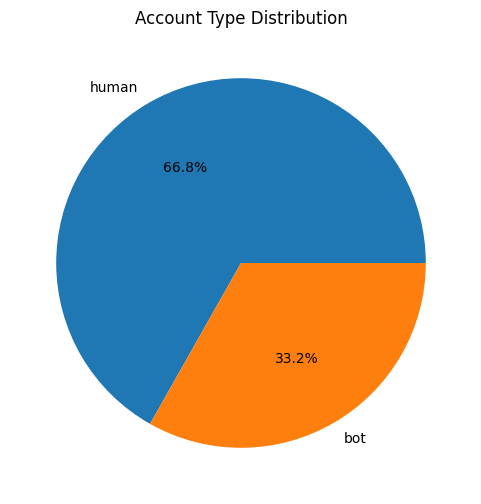
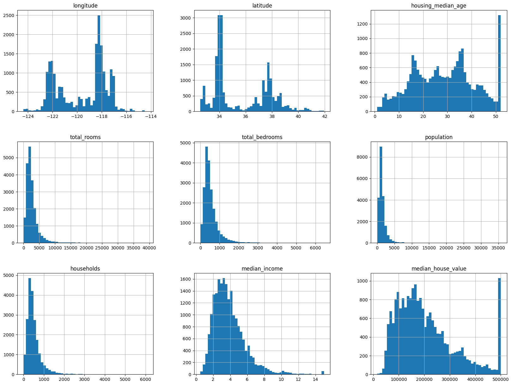

# Enhanced Twitter bot detection using ensemble machine learning
## This project is based on the following paper: https://ieeexplore.ieee.org/stamp/stamp.jsp?tp=&arnumber=9358734&tag=1

**Data Collection:** Twitter profile metadata was collected from Kaggle, originally retrieved from twitter's API.

**Preprocessing:** Includes scaling numeric attributes and encoding categorical attributes, with a focus on Weight of Evidence (WoE) encoding for categorical features.

**Feature Selection:** Techniques like Extra Trees Classifier were used to select prime attributes.

**Machine Learning Algorithms:** Various classifiers like Random Forest.

**Ensemble Learning:** A blending approach was used, combining outputs of different models using Random Forest.

**Performance Evaluation:** The system was assessed using metrics like accuracy, precision, recall, F1-score, and area under the receiver operating characteristic curve (AUC-score).

```python
import numpy as np
import pandas as pd
from sklearn.preprocessing import LabelEncoder
from sklearn.preprocessing import StandardScaler
from sklearn.model_selection import train_test_split
from sklearn.ensemble import RandomForestClassifier
from sklearn.feature_selection import SelectFromModel
from sklearn.metrics import accuracy_score
from sklearn.linear_model import LogisticRegression
from sklearn.svm import SVC

# Load the data
data = pd.read_csv("datasets/twitter_human_bots_dataset.csv")
```


```python
data.describe()
```


<div>
<style scoped>
    .dataframe tbody tr th:only-of-type {
        vertical-align: middle;
    }

    .dataframe tbody tr th {
        vertical-align: top;
    }

    .dataframe thead th {
        text-align: right;
    }
</style>
<table border="1" class="dataframe">
  <thead>
    <tr style="text-align: right;">
      <th></th>
      <th>Unnamed: 0</th>
      <th>favourites_count</th>
      <th>followers_count</th>
      <th>friends_count</th>
      <th>id</th>
      <th>statuses_count</th>
      <th>average_tweets_per_day</th>
      <th>account_age_days</th>
    </tr>
  </thead>
  <tbody>
    <tr>
      <th>count</th>
      <td>37438.000000</td>
      <td>37438.000000</td>
      <td>3.743800e+04</td>
      <td>3.743800e+04</td>
      <td>3.743800e+04</td>
      <td>3.743800e+04</td>
      <td>37438.000000</td>
      <td>37438.000000</td>
    </tr>
    <tr>
      <th>mean</th>
      <td>18718.500000</td>
      <td>12302.062183</td>
      <td>3.703098e+05</td>
      <td>4.445925e+03</td>
      <td>1.221536e+17</td>
      <td>2.107339e+04</td>
      <td>6.891668</td>
      <td>3022.128052</td>
    </tr>
    <tr>
      <th>std</th>
      <td>10807.564026</td>
      <td>33923.650237</td>
      <td>2.470829e+06</td>
      <td>4.954520e+04</td>
      <td>3.004313e+17</td>
      <td>6.732977e+04</td>
      <td>24.580116</td>
      <td>1013.695870</td>
    </tr>
    <tr>
      <th>min</th>
      <td>0.000000</td>
      <td>0.000000</td>
      <td>0.000000e+00</td>
      <td>0.000000e+00</td>
      <td>4.180000e+02</td>
      <td>0.000000e+00</td>
      <td>0.000000</td>
      <td>483.000000</td>
    </tr>
    <tr>
      <th>25%</th>
      <td>9359.250000</td>
      <td>362.000000</td>
      <td>3.500000e+01</td>
      <td>3.700000e+01</td>
      <td>9.957306e+07</td>
      <td>1.336250e+03</td>
      <td>0.495000</td>
      <td>2316.250000</td>
    </tr>
    <tr>
      <th>50%</th>
      <td>18718.500000</td>
      <td>2066.000000</td>
      <td>3.650000e+02</td>
      <td>2.960000e+02</td>
      <td>3.991474e+08</td>
      <td>4.209000e+03</td>
      <td>1.488000</td>
      <td>3219.000000</td>
    </tr>
    <tr>
      <th>75%</th>
      <td>28077.750000</td>
      <td>8879.000000</td>
      <td>8.440250e+03</td>
      <td>8.930000e+02</td>
      <td>2.453826e+09</td>
      <td>1.715375e+04</td>
      <td>5.528000</td>
      <td>3888.000000</td>
    </tr>
    <tr>
      <th>max</th>
      <td>37437.000000</td>
      <td>885123.000000</td>
      <td>1.216415e+08</td>
      <td>4.343060e+06</td>
      <td>1.120974e+18</td>
      <td>2.771910e+06</td>
      <td>1269.055000</td>
      <td>5158.000000</td>
    </tr>
  </tbody>
</table>
</div>


```python
data.info()
```

    <class 'pandas.core.frame.DataFrame'>
    RangeIndex: 37438 entries, 0 to 37437
    Data columns (total 20 columns):
     #   Column                        Non-Null Count  Dtype  
    ---  ------                        --------------  -----  
     0   Unnamed: 0                    37438 non-null  int64  
     1   created_at                    37438 non-null  object 
     2   default_profile               37438 non-null  bool   
     3   default_profile_image         37438 non-null  bool   
     4   description                   30181 non-null  object 
     5   favourites_count              37438 non-null  int64  
     6   followers_count               37438 non-null  int64  
     7   friends_count                 37438 non-null  int64  
     8   geo_enabled                   37438 non-null  bool   
     9   id                            37438 non-null  int64  
     10  lang                          29481 non-null  object 
     11  location                      37434 non-null  object 
     12  profile_background_image_url  32939 non-null  object 
     13  profile_image_url             37437 non-null  object 
     14  screen_name                   37438 non-null  object 
     15  statuses_count                37438 non-null  int64  
     16  verified                      37438 non-null  bool   
     17  average_tweets_per_day        37438 non-null  float64
     18  account_age_days              37438 non-null  int64  
     19  account_type                  37438 non-null  object 
    dtypes: bool(4), float64(1), int64(7), object(8)
    memory usage: 4.7+ MB


```python
import matplotlib.pyplot as plt

df = pd.DataFrame(data)
account_type_count = df["account_type"].value_counts()

plt.figure(figsize=(6, 6))
plt.pie(account_type_count, labels=account_type_count.index, autopct='%1.1f%%')
plt.title("Account Type Distribution")
plt.show()
```


    

    


```python
# Looking at categorical attributes
data["created_at"].value_counts(), data["description"].value_counts()
```


    (created_at
     2016-09-03 20:06:04    2
     2012-11-21 02:56:00    2
     2015-11-03 09:51:18    2
     2009-04-18 00:49:34    2
     2009-04-20 18:36:09    2
                           ..
     2013-01-07 11:13:10    1
     2015-02-07 21:18:39    1
     2009-07-31 04:33:13    1
     2013-12-30 01:52:36    1
     2011-12-12 12:59:28    1
     Name: count, Length: 37430, dtype: int64,
     description
     .                                                                                                                                                  14
     Actor                                                                                                                                              13
     #BlackLivesMatter                                                                                                                                  11
     Experience is one thing you can't get for nothing.                                                                                                  7
     I am not afraid of death; I just don't want to be there when it happens.                                                                            7
                                                                                                                                                        ..
     Photo lover \ Fitness lover. Check this https://t.co/noY24Q7LBq                                                                                     1
     Founded Nanex LLC, created NxCore, a rich streaming data feed allowing unparalleled market analysis. Favorite = thank you/agree. tips@nanex.net     1
     Jorge Celedón, cantante vallenato. Nacido en Villanueva (Guajira) orgullosamente colombiano. Nuevo canal de Youtube: https://goo.gl/KKzoDV          1
     Breaking news from GMA News in the Philippines. Follow @gmanews for more stories.                                                                   1
     你好！中国                                                                                                                                               1
     Name: count, Length: 29944, dtype: int64)


```python
language_counts = data["lang"].value_counts()

plt.figure(figsize=(10, 6))
plt.bar(language_counts.index, language_counts, width=0.8)
plt.yscale("log")
plt.xlabel("language")
plt.ylabel("count")
plt.title("Language Distribution")
plt.xticks(rotation=90)
plt.show()
```


    

    


```python
data["location"].value_counts()[:10]
```


    location
    unknown            13023
    Los Angeles, CA      524
    New York, NY         339
    United States        239
    Washington, DC       224
    Los Angeles          224
    New York             151
    Chicago, IL          142
    London               142
    California, USA      138
    Name: count, dtype: int64


```python
# Drop unnecessary columns
columns_to_drop = ["created_at", "description", "id", "default_profile_image", "profile_image_url", "screen_name", "profile_background_image_url"]
data = data.drop(columns=columns_to_drop)
```


```python
# Label encoding for 'account_type'
label_encoder = LabelEncoder()
data['account_type'] = label_encoder.fit_transform(data['account_type'])
```


```python
# WoE encoding for 'lang' and 'location'
def calculate_woe(data, column, target_column):
    woe_dict = {}
    total_events = data[target_column].sum()
    total_nonevents = data.shape[0] - total_events
    
    for category in data[column].unique():
        events = data[(data[column] == category) & (data[target_column] == 1)].shape[0]
        nonevents = data[(data[column] == category) & (data[target_column] == 0)].shape[0]
        
        if events == 0:
            woe_value = -10  # Clip to a reasonable lower value
        elif nonevents == 0:
            woe_value = 10   # Clip to a reasonable upper value
        else:
            woe_value = np.log((nonevents / total_nonevents) / (events / total_events))
            # Clip the WoE value to a reasonable range
            woe_value = max(-10, min(10, woe_value))
        
        woe_dict[category] = woe_value
    
    return woe_dict

woe_lang = calculate_woe(data, 'lang', 'account_type')
woe_location = calculate_woe(data, 'location', 'account_type')

data['lang'] = data['lang'].map(woe_lang)
data['location'] = data['location'].map(woe_location)
```


```python
# Feature scaling
scaler = StandardScaler()
data[['friends_count', 'favourites_count']] = scaler.fit_transform(data[['friends_count', 'favourites_count']])
```


```python
# Split the data into training and testing
X = data.drop(columns=['account_type'])
y = data['account_type']

X_train, X_test, y_train, y_test = train_test_split(X, y, test_size=0.2, random_state=42)
```


```python
# Feature selection using a Random Forest model
rf_model = RandomForestClassifier()
rf_model.fit(X_train, y_train)
model_feature_selector = SelectFromModel(rf_model, prefit=True)

X_train_selected = model_feature_selector.transform(X_train)
X_test_selected = model_feature_selector.transform(X_test)
```

    /home/test/ml/env2/lib/python3.10/site-packages/sklearn/base.py:458: UserWarning: X has feature names, but SelectFromModel was fitted without feature names
      warnings.warn(
    /home/test/ml/env2/lib/python3.10/site-packages/sklearn/base.py:458: UserWarning: X has feature names, but SelectFromModel was fitted without feature names
      warnings.warn(


```python
# Train a logistic regression model
logistic_regression = LogisticRegression()
logistic_regression.fit(X_train_selected, y_train)

# Make predictions
y_pred = logistic_regression.predict(X_test_selected)

# Evaluate the model
accuracy_lr = accuracy_score(y_test, y_pred)

print(f'Accuracy: {accuracy_lr}')
```

    Accuracy: 0.671073717948718


```python
# Train a Random Forest classifier
rf_classifier = RandomForestClassifier()
rf_classifier.fit(X_train_selected, y_train)

# Make predictions
y_pred = rf_classifier.predict(X_test_selected)

# Evaluate the model
accuracy_rf = accuracy_score(y_test, y_pred)
print(f'Accuracy: {accuracy_rf}')
```

    Accuracy: 0.8895566239316239


```python
from sklearn.metrics import accuracy_score, precision_score, recall_score, f1_score, roc_auc_score

def display_scores(model_name, y_true, y_pred, y_prob):
    accuracy = accuracy_score(y_true, y_pred)
    precision = precision_score(y_true, y_pred)
    recall = recall_score(y_true, y_pred)
    f1 = f1_score(y_true, y_pred)
    auc = roc_auc_score(y_true, y_prob)
    
    print(f"Model: {model_name}")
    print(f"Accuracy: {accuracy}")
    print(f"Precision: {precision}")
    print(f"Recall: {recall}")
    print(f"F1 Score: {f1}")
    print(f"AUC: {auc}")
    print("")

# Assuming you have the predictions and probability estimates for both models
y_pred_lr = logistic_regression.predict(X_test_selected)
y_prob_lr = logistic_regression.predict_proba(X_test_selected)[:, 1]

y_pred_rf = rf_classifier.predict(X_test_selected)
y_prob_rf = rf_classifier.predict_proba(X_test_selected)[:, 1]

#y_pred_svm = svm_classifier.predict(X_test_selected)
#y_prob_svm = svm_classifier.predict_proba(X_test_selected)[:, 1]

display_scores("Logistic Regression", y_test, y_pred_lr, y_prob_lr)
display_scores("Random Forest", y_test, y_pred_rf, y_prob_rf)
#display_scores("SVM", y_test, y_pred_svm, y_prob_svm)

```

    Model: Logistic Regression
    Accuracy: 0.671073717948718
    Precision: 0.6700616456714018
    Recall: 0.9998000399920016
    F1 Score: 0.8023750300890637
    AUC: 0.8060603400027674
    
    Model: Random Forest
    Accuracy: 0.8895566239316239
    Precision: 0.9019645608628659
    Recall: 0.9364127174565087
    F1 Score: 0.9188658883547532
    AUC: 0.9452457317141316
    


```python
from sklearn.ensemble import GradientBoostingClassifier

# Train a Gradient Boosting classifier
gb_classifier = GradientBoostingClassifier()
gb_classifier.fit(X_train_selected, y_train)

# Make predictions
y_pred_gb = gb_classifier.predict(X_test_selected)
y_prob_gb = gb_classifier.predict_proba(X_test_selected)[:, 1]

# Evaluate the model
display_scores("Gradient Boosting", y_test, y_pred_gb, y_prob_gb)

```

    Model: Gradient Boosting
    Accuracy: 0.8875534188034188
    Precision: 0.902302186109499
    Recall: 0.9326134773045391
    F1 Score: 0.9172074729596855
    AUC: 0.9533640115563538
    


```python
# Get probability predictions from each model
probs_lr = logistic_regression.predict_proba(X_test_selected)[:, 1]
probs_rf = rf_classifier.predict_proba(X_test_selected)[:, 1]
probs_gb = gb_classifier.predict_proba(X_test_selected)[:, 1]

# Average the probabilities
average_probs = (probs_lr + probs_rf + probs_gb) / 3

# Convert average probabilities to final predictions (0 or 1)
y_pred_ensemble = np.where(average_probs >= 0.5, 1, 0)

# Evaluate the ensemble model
display_scores("Ensemble (LR, RF, GB)", y_test, y_pred_ensemble, average_probs)
```

    Model: Ensemble (LR, RF, GB)
    Accuracy: 0.8930288461538461
    Precision: 0.9043126684636119
    Recall: 0.9392121575684863
    F1 Score: 0.9214320745463463
    AUC: 0.9489852331101936
    


```python

```
