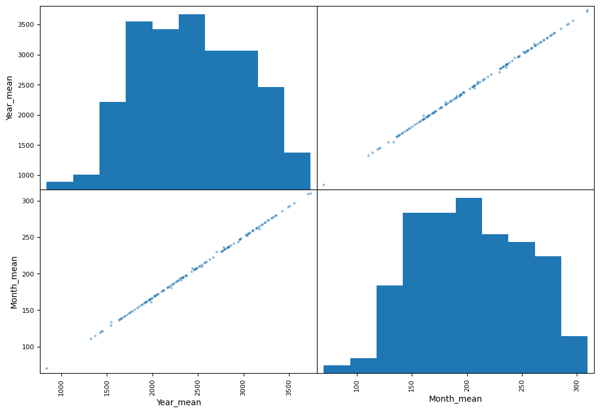

```python
#Implementing supervised learning using regression to predict values

import pandas as pd

housingData = pd.read_csv("./datasets/housing/housing.csv")
```


```python
#Quick look at the data structure
housingData.head()
```


<div>
<style scoped>
    .dataframe tbody tr th:only-of-type {
        vertical-align: middle;
    }

    .dataframe tbody tr th {
        vertical-align: top;
    }

    .dataframe thead th {
        text-align: right;
    }
</style>
<table border="1" class="dataframe">
  <thead>
    <tr style="text-align: right;">
      <th></th>
      <th>longitude</th>
      <th>latitude</th>
      <th>housing_median_age</th>
      <th>total_rooms</th>
      <th>total_bedrooms</th>
      <th>population</th>
      <th>households</th>
      <th>median_income</th>
      <th>median_house_value</th>
      <th>ocean_proximity</th>
    </tr>
  </thead>
  <tbody>
    <tr>
      <th>0</th>
      <td>-122.23</td>
      <td>37.88</td>
      <td>41.0</td>
      <td>880.0</td>
      <td>129.0</td>
      <td>322.0</td>
      <td>126.0</td>
      <td>8.3252</td>
      <td>452600.0</td>
      <td>NEAR BAY</td>
    </tr>
    <tr>
      <th>1</th>
      <td>-122.22</td>
      <td>37.86</td>
      <td>21.0</td>
      <td>7099.0</td>
      <td>1106.0</td>
      <td>2401.0</td>
      <td>1138.0</td>
      <td>8.3014</td>
      <td>358500.0</td>
      <td>NEAR BAY</td>
    </tr>
    <tr>
      <th>2</th>
      <td>-122.24</td>
      <td>37.85</td>
      <td>52.0</td>
      <td>1467.0</td>
      <td>190.0</td>
      <td>496.0</td>
      <td>177.0</td>
      <td>7.2574</td>
      <td>352100.0</td>
      <td>NEAR BAY</td>
    </tr>
    <tr>
      <th>3</th>
      <td>-122.25</td>
      <td>37.85</td>
      <td>52.0</td>
      <td>1274.0</td>
      <td>235.0</td>
      <td>558.0</td>
      <td>219.0</td>
      <td>5.6431</td>
      <td>341300.0</td>
      <td>NEAR BAY</td>
    </tr>
    <tr>
      <th>4</th>
      <td>-122.25</td>
      <td>37.85</td>
      <td>52.0</td>
      <td>1627.0</td>
      <td>280.0</td>
      <td>565.0</td>
      <td>259.0</td>
      <td>3.8462</td>
      <td>342200.0</td>
      <td>NEAR BAY</td>
    </tr>
  </tbody>
</table>
</div>


```python
#We can see that the attribute 'total_bedrooms' is missing data
#And there seems to be a categorical attribute "ocean_proximity"
housingData.info()
```

    <class 'pandas.core.frame.DataFrame'>
    RangeIndex: 20640 entries, 0 to 20639
    Data columns (total 10 columns):
     #   Column              Non-Null Count  Dtype  
    ---  ------              --------------  -----  
     0   longitude           20640 non-null  float64
     1   latitude            20640 non-null  float64
     2   housing_median_age  20640 non-null  float64
     3   total_rooms         20640 non-null  float64
     4   total_bedrooms      20433 non-null  float64
     5   population          20640 non-null  float64
     6   households          20640 non-null  float64
     7   median_income       20640 non-null  float64
     8   median_house_value  20640 non-null  float64
     9   ocean_proximity     20640 non-null  object 
    dtypes: float64(9), object(1)
    memory usage: 1.6+ MB


```python
#We can see the 5 categorical attributes of 'ocean_proximity'
housingData["ocean_proximity"].value_counts ()
```


    ocean_proximity
    <1H OCEAN     9136
    INLAND        6551
    NEAR OCEAN    2658
    NEAR BAY      2290
    ISLAND           5
    Name: count, dtype: int64


```python
#Let see a summary of the numerical attributes
housingData.describe()
```


<div>
<style scoped>
    .dataframe tbody tr th:only-of-type {
        vertical-align: middle;
    }

    .dataframe tbody tr th {
        vertical-align: top;
    }

    .dataframe thead th {
        text-align: right;
    }
</style>
<table border="1" class="dataframe">
  <thead>
    <tr style="text-align: right;">
      <th></th>
      <th>longitude</th>
      <th>latitude</th>
      <th>housing_median_age</th>
      <th>total_rooms</th>
      <th>total_bedrooms</th>
      <th>population</th>
      <th>households</th>
      <th>median_income</th>
      <th>median_house_value</th>
    </tr>
  </thead>
  <tbody>
    <tr>
      <th>count</th>
      <td>20640.000000</td>
      <td>20640.000000</td>
      <td>20640.000000</td>
      <td>20640.000000</td>
      <td>20433.000000</td>
      <td>20640.000000</td>
      <td>20640.000000</td>
      <td>20640.000000</td>
      <td>20640.000000</td>
    </tr>
    <tr>
      <th>mean</th>
      <td>-119.569704</td>
      <td>35.631861</td>
      <td>28.639486</td>
      <td>2635.763081</td>
      <td>537.870553</td>
      <td>1425.476744</td>
      <td>499.539680</td>
      <td>3.870671</td>
      <td>206855.816909</td>
    </tr>
    <tr>
      <th>std</th>
      <td>2.003532</td>
      <td>2.135952</td>
      <td>12.585558</td>
      <td>2181.615252</td>
      <td>421.385070</td>
      <td>1132.462122</td>
      <td>382.329753</td>
      <td>1.899822</td>
      <td>115395.615874</td>
    </tr>
    <tr>
      <th>min</th>
      <td>-124.350000</td>
      <td>32.540000</td>
      <td>1.000000</td>
      <td>2.000000</td>
      <td>1.000000</td>
      <td>3.000000</td>
      <td>1.000000</td>
      <td>0.499900</td>
      <td>14999.000000</td>
    </tr>
    <tr>
      <th>25%</th>
      <td>-121.800000</td>
      <td>33.930000</td>
      <td>18.000000</td>
      <td>1447.750000</td>
      <td>296.000000</td>
      <td>787.000000</td>
      <td>280.000000</td>
      <td>2.563400</td>
      <td>119600.000000</td>
    </tr>
    <tr>
      <th>50%</th>
      <td>-118.490000</td>
      <td>34.260000</td>
      <td>29.000000</td>
      <td>2127.000000</td>
      <td>435.000000</td>
      <td>1166.000000</td>
      <td>409.000000</td>
      <td>3.534800</td>
      <td>179700.000000</td>
    </tr>
    <tr>
      <th>75%</th>
      <td>-118.010000</td>
      <td>37.710000</td>
      <td>37.000000</td>
      <td>3148.000000</td>
      <td>647.000000</td>
      <td>1725.000000</td>
      <td>605.000000</td>
      <td>4.743250</td>
      <td>264725.000000</td>
    </tr>
    <tr>
      <th>max</th>
      <td>-114.310000</td>
      <td>41.950000</td>
      <td>52.000000</td>
      <td>39320.000000</td>
      <td>6445.000000</td>
      <td>35682.000000</td>
      <td>6082.000000</td>
      <td>15.000100</td>
      <td>500001.000000</td>
    </tr>
  </tbody>
</table>
</div>


```python
#Looking further at the data using histogram plots
%matplotlib inline
import matplotlib.pyplot as plt
housingData.hist(bins=50, figsize=(20,15))
plt.show()
```


    

    


```python
#Create a test set which is 20% of the total 
from sklearn.model_selection import train_test_split

(train_set, test_set) = train_test_split(housingData, test_size=0.2, random_state=42)

test_set.head()
```


<div>
<style scoped>
    .dataframe tbody tr th:only-of-type {
        vertical-align: middle;
    }

    .dataframe tbody tr th {
        vertical-align: top;
    }

    .dataframe thead th {
        text-align: right;
    }
</style>
<table border="1" class="dataframe">
  <thead>
    <tr style="text-align: right;">
      <th></th>
      <th>longitude</th>
      <th>latitude</th>
      <th>housing_median_age</th>
      <th>total_rooms</th>
      <th>total_bedrooms</th>
      <th>population</th>
      <th>households</th>
      <th>median_income</th>
      <th>median_house_value</th>
      <th>ocean_proximity</th>
    </tr>
  </thead>
  <tbody>
    <tr>
      <th>20046</th>
      <td>-119.01</td>
      <td>36.06</td>
      <td>25.0</td>
      <td>1505.0</td>
      <td>NaN</td>
      <td>1392.0</td>
      <td>359.0</td>
      <td>1.6812</td>
      <td>47700.0</td>
      <td>INLAND</td>
    </tr>
    <tr>
      <th>3024</th>
      <td>-119.46</td>
      <td>35.14</td>
      <td>30.0</td>
      <td>2943.0</td>
      <td>NaN</td>
      <td>1565.0</td>
      <td>584.0</td>
      <td>2.5313</td>
      <td>45800.0</td>
      <td>INLAND</td>
    </tr>
    <tr>
      <th>15663</th>
      <td>-122.44</td>
      <td>37.80</td>
      <td>52.0</td>
      <td>3830.0</td>
      <td>NaN</td>
      <td>1310.0</td>
      <td>963.0</td>
      <td>3.4801</td>
      <td>500001.0</td>
      <td>NEAR BAY</td>
    </tr>
    <tr>
      <th>20484</th>
      <td>-118.72</td>
      <td>34.28</td>
      <td>17.0</td>
      <td>3051.0</td>
      <td>NaN</td>
      <td>1705.0</td>
      <td>495.0</td>
      <td>5.7376</td>
      <td>218600.0</td>
      <td>&lt;1H OCEAN</td>
    </tr>
    <tr>
      <th>9814</th>
      <td>-121.93</td>
      <td>36.62</td>
      <td>34.0</td>
      <td>2351.0</td>
      <td>NaN</td>
      <td>1063.0</td>
      <td>428.0</td>
      <td>3.7250</td>
      <td>278000.0</td>
      <td>NEAR OCEAN</td>
    </tr>
  </tbody>
</table>
</div>


```python
#By looking at the median income histogram we can see that values are clustered towards the left
#But some values are outliers - this will mess with the evaluation
#So we can categorise the data to make it more even using the cut method

import numpy as np

housingData["income_cat"] = pd.cut(housingData["median_income"],
                               bins=[0.,1.5,3.0,4.5,6.,np.inf],
                               labels=[1,2,3,4,5])
housingData["income_cat"].hist()
```


    <Axes: >


    

    


```python
#We can see the newly added column 'income_cat'
housingData.head()
```


<div>
<style scoped>
    .dataframe tbody tr th:only-of-type {
        vertical-align: middle;
    }

    .dataframe tbody tr th {
        vertical-align: top;
    }

    .dataframe thead th {
        text-align: right;
    }
</style>
<table border="1" class="dataframe">
  <thead>
    <tr style="text-align: right;">
      <th></th>
      <th>longitude</th>
      <th>latitude</th>
      <th>housing_median_age</th>
      <th>total_rooms</th>
      <th>total_bedrooms</th>
      <th>population</th>
      <th>households</th>
      <th>median_income</th>
      <th>median_house_value</th>
      <th>ocean_proximity</th>
      <th>income_cat</th>
    </tr>
  </thead>
  <tbody>
    <tr>
      <th>0</th>
      <td>-122.23</td>
      <td>37.88</td>
      <td>41.0</td>
      <td>880.0</td>
      <td>129.0</td>
      <td>322.0</td>
      <td>126.0</td>
      <td>8.3252</td>
      <td>452600.0</td>
      <td>NEAR BAY</td>
      <td>5</td>
    </tr>
    <tr>
      <th>1</th>
      <td>-122.22</td>
      <td>37.86</td>
      <td>21.0</td>
      <td>7099.0</td>
      <td>1106.0</td>
      <td>2401.0</td>
      <td>1138.0</td>
      <td>8.3014</td>
      <td>358500.0</td>
      <td>NEAR BAY</td>
      <td>5</td>
    </tr>
    <tr>
      <th>2</th>
      <td>-122.24</td>
      <td>37.85</td>
      <td>52.0</td>
      <td>1467.0</td>
      <td>190.0</td>
      <td>496.0</td>
      <td>177.0</td>
      <td>7.2574</td>
      <td>352100.0</td>
      <td>NEAR BAY</td>
      <td>5</td>
    </tr>
    <tr>
      <th>3</th>
      <td>-122.25</td>
      <td>37.85</td>
      <td>52.0</td>
      <td>1274.0</td>
      <td>235.0</td>
      <td>558.0</td>
      <td>219.0</td>
      <td>5.6431</td>
      <td>341300.0</td>
      <td>NEAR BAY</td>
      <td>4</td>
    </tr>
    <tr>
      <th>4</th>
      <td>-122.25</td>
      <td>37.85</td>
      <td>52.0</td>
      <td>1627.0</td>
      <td>280.0</td>
      <td>565.0</td>
      <td>259.0</td>
      <td>3.8462</td>
      <td>342200.0</td>
      <td>NEAR BAY</td>
      <td>3</td>
    </tr>
  </tbody>
</table>
</div>


```python
#Now we can do stratified sampling to check 'income category' proportions

from sklearn.model_selection import StratifiedShuffleSplit

split = StratifiedShuffleSplit(n_splits=1, test_size=0.2, random_state=42)

for (train_index, test_index) in split.split(housingData, housingData["income_cat"]):
    strat_train_set = housingData.loc[train_index]
    strat_test_set = housingData.loc[test_index]
    
(train_index, test_index)
```


    (array([12655, 15502,  2908, ..., 19263, 19140, 19773]),
     array([ 5241, 17352,  3505, ..., 17223, 10786,  3965]))


```python
strat_test_set["income_cat"].value_counts()/len(strat_test_set)

# | Category | proportion |
# | 3        | 35%        |
# | 2        | 31%        |
# | 4        | 17%        |
# | 5        | 11%        |
# | 1        | 3%         |

#Matches the histogram plot
```


    income_cat
    3    0.350533
    2    0.318798
    4    0.176357
    5    0.114341
    1    0.039971
    Name: count, dtype: float64


```python
# Remove the the 'income_cat' so the data is back to normal
for set_ in (strat_train_set, strat_test_set):
    set_.drop("income_cat", axis=1, inplace=True)
```


```python
#Copy the data so we can play with it safely
housing = housingData.copy()
```


```python
#Plot the geographical data
housing.plot(kind="scatter", x="longitude", y="latitude", alpha=0.4,
s=housing["population"]/100, label="population", figsize=(10,7),
c="median_house_value", cmap=plt.get_cmap("jet"), colorbar=True,
)
plt.legend()
```


    <matplotlib.legend.Legend at 0x7f17484ead00>


    

    


```python
#Look at the standard correlation coefficient
housing_no_ocean_proximity = housing.drop("ocean_proximity", axis=1)
corr_matrix = housing_no_ocean_proximity.corr()

#The correlation between 'median_house_value' in relation to all other columns
corr_matrix["median_house_value"].sort_values(ascending=False)
```


    median_house_value    1.000000
    median_income         0.688075
    income_cat            0.643892
    total_rooms           0.134153
    housing_median_age    0.105623
    households            0.065843
    total_bedrooms        0.049686
    population           -0.024650
    longitude            -0.045967
    latitude             -0.144160
    Name: median_house_value, dtype: float64


```python
#Scatter matrix plots every numerical attribute against every other numrical attribute

from pandas.plotting import scatter_matrix

attributes = ["median_house_value", "median_income", "total_rooms", "housing_median_age"]
scatter_matrix(housing[attributes], figsize=(12, 8))
```


    array([[<Axes: xlabel='median_house_value', ylabel='median_house_value'>,
            <Axes: xlabel='median_income', ylabel='median_house_value'>,
            <Axes: xlabel='total_rooms', ylabel='median_house_value'>,
            <Axes: xlabel='housing_median_age', ylabel='median_house_value'>],
           [<Axes: xlabel='median_house_value', ylabel='median_income'>,
            <Axes: xlabel='median_income', ylabel='median_income'>,
            <Axes: xlabel='total_rooms', ylabel='median_income'>,
            <Axes: xlabel='housing_median_age', ylabel='median_income'>],
           [<Axes: xlabel='median_house_value', ylabel='total_rooms'>,
            <Axes: xlabel='median_income', ylabel='total_rooms'>,
            <Axes: xlabel='total_rooms', ylabel='total_rooms'>,
            <Axes: xlabel='housing_median_age', ylabel='total_rooms'>],
           [<Axes: xlabel='median_house_value', ylabel='housing_median_age'>,
            <Axes: xlabel='median_income', ylabel='housing_median_age'>,
            <Axes: xlabel='total_rooms', ylabel='housing_median_age'>,
            <Axes: xlabel='housing_median_age', ylabel='housing_median_age'>]],
          dtype=object)


    

    


```python
#The most promising attribute to predict the median value is the 'median_income'
#Lets look at specifically

housing.plot(kind="scatter", x="median_income", y="median_house_value", alpha=0.1)

#We can see a cap in the data gathered
```


    <Axes: xlabel='median_income', ylabel='median_house_value'>


    

    


```python
#Looking at attribute combinations

#New attribute 'rooms_per_household'
housing["rooms_per_household"] = housing["total_rooms"]/housing["households"]

#New attribute 'rooms_per_household'
housing["bedrooms_per_room"] = housing["total_bedrooms"]/housing["total_rooms"]


housing.head()
```


<div>
<style scoped>
    .dataframe tbody tr th:only-of-type {
        vertical-align: middle;
    }

    .dataframe tbody tr th {
        vertical-align: top;
    }

    .dataframe thead th {
        text-align: right;
    }
</style>
<table border="1" class="dataframe">
  <thead>
    <tr style="text-align: right;">
      <th></th>
      <th>longitude</th>
      <th>latitude</th>
      <th>housing_median_age</th>
      <th>total_rooms</th>
      <th>total_bedrooms</th>
      <th>population</th>
      <th>households</th>
      <th>median_income</th>
      <th>median_house_value</th>
      <th>ocean_proximity</th>
      <th>income_cat</th>
      <th>rooms_per_household</th>
      <th>bedrooms_per_room</th>
    </tr>
  </thead>
  <tbody>
    <tr>
      <th>0</th>
      <td>-122.23</td>
      <td>37.88</td>
      <td>41.0</td>
      <td>880.0</td>
      <td>129.0</td>
      <td>322.0</td>
      <td>126.0</td>
      <td>8.3252</td>
      <td>452600.0</td>
      <td>NEAR BAY</td>
      <td>5</td>
      <td>6.984127</td>
      <td>0.146591</td>
    </tr>
    <tr>
      <th>1</th>
      <td>-122.22</td>
      <td>37.86</td>
      <td>21.0</td>
      <td>7099.0</td>
      <td>1106.0</td>
      <td>2401.0</td>
      <td>1138.0</td>
      <td>8.3014</td>
      <td>358500.0</td>
      <td>NEAR BAY</td>
      <td>5</td>
      <td>6.238137</td>
      <td>0.155797</td>
    </tr>
    <tr>
      <th>2</th>
      <td>-122.24</td>
      <td>37.85</td>
      <td>52.0</td>
      <td>1467.0</td>
      <td>190.0</td>
      <td>496.0</td>
      <td>177.0</td>
      <td>7.2574</td>
      <td>352100.0</td>
      <td>NEAR BAY</td>
      <td>5</td>
      <td>8.288136</td>
      <td>0.129516</td>
    </tr>
    <tr>
      <th>3</th>
      <td>-122.25</td>
      <td>37.85</td>
      <td>52.0</td>
      <td>1274.0</td>
      <td>235.0</td>
      <td>558.0</td>
      <td>219.0</td>
      <td>5.6431</td>
      <td>341300.0</td>
      <td>NEAR BAY</td>
      <td>4</td>
      <td>5.817352</td>
      <td>0.184458</td>
    </tr>
    <tr>
      <th>4</th>
      <td>-122.25</td>
      <td>37.85</td>
      <td>52.0</td>
      <td>1627.0</td>
      <td>280.0</td>
      <td>565.0</td>
      <td>259.0</td>
      <td>3.8462</td>
      <td>342200.0</td>
      <td>NEAR BAY</td>
      <td>3</td>
      <td>6.281853</td>
      <td>0.172096</td>
    </tr>
  </tbody>
</table>
</div>


```python
#We can now look at any correlations with 'median_house_value' from the newly added attributes
housing_no_ocean_proximity2 = housing.drop("ocean_proximity", axis=1)
corr_matrix = housing_no_ocean_proximity2.corr()
corr_matrix["median_house_value"].sort_values(ascending=False)
```


    median_house_value     1.000000
    median_income          0.688075
    income_cat             0.643892
    rooms_per_household    0.151948
    total_rooms            0.134153
    housing_median_age     0.105623
    households             0.065843
    total_bedrooms         0.049686
    population            -0.024650
    longitude             -0.045967
    latitude              -0.144160
    bedrooms_per_room     -0.255880
    Name: median_house_value, dtype: float64


```python
#Prepare data for machine learning algorithms

#Separate the predictors from the labels
housing = strat_train_set.drop("median_house_value", axis=1)
housing_labels = strat_train_set["median_house_value"].copy()
```


```python
#Take care of missing values unsing SimpleImputer

from sklearn.impute import SimpleImputer


imputer = SimpleImputer(strategy="median")
housing_no_ocean_proximity3 = housing.drop("ocean_proximity", axis=1)
imputer.fit(housing_no_ocean_proximity3)

#imputer returns a numpy array, convert it into a dataframe
X = imputer.transform(housing_no_ocean_proximity3)
housing_filled = pd.DataFrame(X, columns=housing_no_ocean_proximity3.columns)
```


```python
#Handling text and categorical attributes
#Lets convert any categorical attributes to numerical representations
#We will be using ColumnTransformer

from sklearn.base import BaseEstimator, TransformerMixin

rooms_ix, bedrooms_ix, population_ix, households_ix = 3, 4, 5, 6

class CombinedAttributesAdder(BaseEstimator, TransformerMixin):
    def __init__(self, add_bedrooms_per_room = True): # no *args or **kargs
        self.add_bedrooms_per_room = add_bedrooms_per_room
    def fit(self, X, y=None):
        return self # nothing else to do
    def transform(self, X, y=None):
        rooms_per_household = X[:, rooms_ix] / X[:, households_ix]
        population_per_household = X[:, population_ix] / X[:, households_ix]
        if self.add_bedrooms_per_room:
            bedrooms_per_room = X[:, bedrooms_ix] / X[:, rooms_ix]
            return np.c_[X, rooms_per_household, population_per_household, bedrooms_per_room]
        else:
            return np.c_[X, rooms_per_household, population_per_household]

from sklearn.pipeline import Pipeline
from sklearn.preprocessing import StandardScaler

num_pipeline = Pipeline([
    ('imputer', SimpleImputer(strategy="median")),
    ('attribs_adder', CombinedAttributesAdder()),
    ('std_scaler', StandardScaler()),
])

from sklearn.compose import ColumnTransformer
from sklearn.preprocessing import OneHotEncoder

num_attribs = list(housing_no_ocean_proximity3)
cat_attribs = ["ocean_proximity"]

full_pipeline = ColumnTransformer([
    ("num", num_pipeline, num_attribs),
    ("cat", OneHotEncoder(), cat_attribs)
])

housing_prepared = full_pipeline.fit_transform(housing)
pd.DataFrame(housing_prepared)
```


<div>
<style scoped>
    .dataframe tbody tr th:only-of-type {
        vertical-align: middle;
    }

    .dataframe tbody tr th {
        vertical-align: top;
    }

    .dataframe thead th {
        text-align: right;
    }
</style>
<table border="1" class="dataframe">
  <thead>
    <tr style="text-align: right;">
      <th></th>
      <th>0</th>
      <th>1</th>
      <th>2</th>
      <th>3</th>
      <th>4</th>
      <th>5</th>
      <th>6</th>
      <th>7</th>
      <th>8</th>
      <th>9</th>
      <th>10</th>
      <th>11</th>
      <th>12</th>
      <th>13</th>
      <th>14</th>
      <th>15</th>
    </tr>
  </thead>
  <tbody>
    <tr>
      <th>0</th>
      <td>-0.941350</td>
      <td>1.347438</td>
      <td>0.027564</td>
      <td>0.584777</td>
      <td>0.640371</td>
      <td>0.732602</td>
      <td>0.556286</td>
      <td>-0.893647</td>
      <td>0.017395</td>
      <td>0.006223</td>
      <td>-0.121122</td>
      <td>0.0</td>
      <td>1.0</td>
      <td>0.0</td>
      <td>0.0</td>
      <td>0.0</td>
    </tr>
    <tr>
      <th>1</th>
      <td>1.171782</td>
      <td>-1.192440</td>
      <td>-1.722018</td>
      <td>1.261467</td>
      <td>0.781561</td>
      <td>0.533612</td>
      <td>0.721318</td>
      <td>1.292168</td>
      <td>0.569256</td>
      <td>-0.040811</td>
      <td>-0.810867</td>
      <td>0.0</td>
      <td>0.0</td>
      <td>0.0</td>
      <td>0.0</td>
      <td>1.0</td>
    </tr>
    <tr>
      <th>2</th>
      <td>0.267581</td>
      <td>-0.125972</td>
      <td>1.220460</td>
      <td>-0.469773</td>
      <td>-0.545138</td>
      <td>-0.674675</td>
      <td>-0.524407</td>
      <td>-0.525434</td>
      <td>-0.018024</td>
      <td>-0.075371</td>
      <td>-0.338273</td>
      <td>0.0</td>
      <td>1.0</td>
      <td>0.0</td>
      <td>0.0</td>
      <td>0.0</td>
    </tr>
    <tr>
      <th>3</th>
      <td>1.221738</td>
      <td>-1.351474</td>
      <td>-0.370069</td>
      <td>-0.348652</td>
      <td>-0.036367</td>
      <td>-0.467617</td>
      <td>-0.037297</td>
      <td>-0.865929</td>
      <td>-0.595140</td>
      <td>-0.106803</td>
      <td>0.961205</td>
      <td>0.0</td>
      <td>0.0</td>
      <td>0.0</td>
      <td>0.0</td>
      <td>1.0</td>
    </tr>
    <tr>
      <th>4</th>
      <td>0.437431</td>
      <td>-0.635818</td>
      <td>-0.131489</td>
      <td>0.427179</td>
      <td>0.272790</td>
      <td>0.374060</td>
      <td>0.220898</td>
      <td>0.325752</td>
      <td>0.251241</td>
      <td>0.006109</td>
      <td>-0.474513</td>
      <td>1.0</td>
      <td>0.0</td>
      <td>0.0</td>
      <td>0.0</td>
      <td>0.0</td>
    </tr>
    <tr>
      <th>...</th>
      <td>...</td>
      <td>...</td>
      <td>...</td>
      <td>...</td>
      <td>...</td>
      <td>...</td>
      <td>...</td>
      <td>...</td>
      <td>...</td>
      <td>...</td>
      <td>...</td>
      <td>...</td>
      <td>...</td>
      <td>...</td>
      <td>...</td>
      <td>...</td>
    </tr>
    <tr>
      <th>16507</th>
      <td>1.251711</td>
      <td>-1.220505</td>
      <td>-1.165333</td>
      <td>1.890456</td>
      <td>1.696862</td>
      <td>0.543471</td>
      <td>1.341519</td>
      <td>0.637374</td>
      <td>0.466353</td>
      <td>-0.092580</td>
      <td>-0.443846</td>
      <td>1.0</td>
      <td>0.0</td>
      <td>0.0</td>
      <td>0.0</td>
      <td>0.0</td>
    </tr>
    <tr>
      <th>16508</th>
      <td>-0.921368</td>
      <td>1.342761</td>
      <td>-1.085806</td>
      <td>2.468471</td>
      <td>2.161816</td>
      <td>3.002174</td>
      <td>2.451492</td>
      <td>-0.557509</td>
      <td>0.050362</td>
      <td>0.023024</td>
      <td>-0.516065</td>
      <td>0.0</td>
      <td>1.0</td>
      <td>0.0</td>
      <td>0.0</td>
      <td>0.0</td>
    </tr>
    <tr>
      <th>16509</th>
      <td>-1.570794</td>
      <td>1.310018</td>
      <td>1.538566</td>
      <td>-0.895802</td>
      <td>-0.895679</td>
      <td>-0.862013</td>
      <td>-0.865118</td>
      <td>-0.365475</td>
      <td>-0.509240</td>
      <td>-0.037436</td>
      <td>0.322869</td>
      <td>1.0</td>
      <td>0.0</td>
      <td>0.0</td>
      <td>0.0</td>
      <td>0.0</td>
    </tr>
    <tr>
      <th>16510</th>
      <td>-1.560803</td>
      <td>1.249211</td>
      <td>-1.165333</td>
      <td>0.249005</td>
      <td>0.112126</td>
      <td>-0.189747</td>
      <td>0.010616</td>
      <td>0.168261</td>
      <td>0.328149</td>
      <td>-0.059156</td>
      <td>-0.457023</td>
      <td>1.0</td>
      <td>0.0</td>
      <td>0.0</td>
      <td>0.0</td>
      <td>0.0</td>
    </tr>
    <tr>
      <th>16511</th>
      <td>-1.281050</td>
      <td>2.025674</td>
      <td>-0.131489</td>
      <td>-0.721836</td>
      <td>-0.759358</td>
      <td>-0.712322</td>
      <td>-0.798573</td>
      <td>-0.390569</td>
      <td>0.014072</td>
      <td>0.006571</td>
      <td>-0.121697</td>
      <td>0.0</td>
      <td>1.0</td>
      <td>0.0</td>
      <td>0.0</td>
      <td>0.0</td>
    </tr>
  </tbody>
</table>
<p>16512 rows × 16 columns</p>
</div>


```python
#Select and train a model

from sklearn.linear_model import LinearRegression

lin_reg = LinearRegression()
lin_reg.fit(housing_prepared, housing_labels)
```


<style>#sk-container-id-1 {color: black;background-color: white;}#sk-container-id-1 pre{padding: 0;}#sk-container-id-1 div.sk-toggleable {background-color: white;}#sk-container-id-1 label.sk-toggleable__label {cursor: pointer;display: block;width: 100%;margin-bottom: 0;padding: 0.3em;box-sizing: border-box;text-align: center;}#sk-container-id-1 label.sk-toggleable__label-arrow:before {content: "▸";float: left;margin-right: 0.25em;color: #696969;}#sk-container-id-1 label.sk-toggleable__label-arrow:hover:before {color: black;}#sk-container-id-1 div.sk-estimator:hover label.sk-toggleable__label-arrow:before {color: black;}#sk-container-id-1 div.sk-toggleable__content {max-height: 0;max-width: 0;overflow: hidden;text-align: left;background-color: #f0f8ff;}#sk-container-id-1 div.sk-toggleable__content pre {margin: 0.2em;color: black;border-radius: 0.25em;background-color: #f0f8ff;}#sk-container-id-1 input.sk-toggleable__control:checked~div.sk-toggleable__content {max-height: 200px;max-width: 100%;overflow: auto;}#sk-container-id-1 input.sk-toggleable__control:checked~label.sk-toggleable__label-arrow:before {content: "▾";}#sk-container-id-1 div.sk-estimator input.sk-toggleable__control:checked~label.sk-toggleable__label {background-color: #d4ebff;}#sk-container-id-1 div.sk-label input.sk-toggleable__control:checked~label.sk-toggleable__label {background-color: #d4ebff;}#sk-container-id-1 input.sk-hidden--visually {border: 0;clip: rect(1px 1px 1px 1px);clip: rect(1px, 1px, 1px, 1px);height: 1px;margin: -1px;overflow: hidden;padding: 0;position: absolute;width: 1px;}#sk-container-id-1 div.sk-estimator {font-family: monospace;background-color: #f0f8ff;border: 1px dotted black;border-radius: 0.25em;box-sizing: border-box;margin-bottom: 0.5em;}#sk-container-id-1 div.sk-estimator:hover {background-color: #d4ebff;}#sk-container-id-1 div.sk-parallel-item::after {content: "";width: 100%;border-bottom: 1px solid gray;flex-grow: 1;}#sk-container-id-1 div.sk-label:hover label.sk-toggleable__label {background-color: #d4ebff;}#sk-container-id-1 div.sk-serial::before {content: "";position: absolute;border-left: 1px solid gray;box-sizing: border-box;top: 0;bottom: 0;left: 50%;z-index: 0;}#sk-container-id-1 div.sk-serial {display: flex;flex-direction: column;align-items: center;background-color: white;padding-right: 0.2em;padding-left: 0.2em;position: relative;}#sk-container-id-1 div.sk-item {position: relative;z-index: 1;}#sk-container-id-1 div.sk-parallel {display: flex;align-items: stretch;justify-content: center;background-color: white;position: relative;}#sk-container-id-1 div.sk-item::before, #sk-container-id-1 div.sk-parallel-item::before {content: "";position: absolute;border-left: 1px solid gray;box-sizing: border-box;top: 0;bottom: 0;left: 50%;z-index: -1;}#sk-container-id-1 div.sk-parallel-item {display: flex;flex-direction: column;z-index: 1;position: relative;background-color: white;}#sk-container-id-1 div.sk-parallel-item:first-child::after {align-self: flex-end;width: 50%;}#sk-container-id-1 div.sk-parallel-item:last-child::after {align-self: flex-start;width: 50%;}#sk-container-id-1 div.sk-parallel-item:only-child::after {width: 0;}#sk-container-id-1 div.sk-dashed-wrapped {border: 1px dashed gray;margin: 0 0.4em 0.5em 0.4em;box-sizing: border-box;padding-bottom: 0.4em;background-color: white;}#sk-container-id-1 div.sk-label label {font-family: monospace;font-weight: bold;display: inline-block;line-height: 1.2em;}#sk-container-id-1 div.sk-label-container {text-align: center;}#sk-container-id-1 div.sk-container {/* jupyter's `normalize.less` sets `[hidden] { display: none; }` but bootstrap.min.css set `[hidden] { display: none !important; }` so we also need the `!important` here to be able to override the default hidden behavior on the sphinx rendered scikit-learn.org. See: https://github.com/scikit-learn/scikit-learn/issues/21755 */display: inline-block !important;position: relative;}#sk-container-id-1 div.sk-text-repr-fallback {display: none;}</style><div id="sk-container-id-1" class="sk-top-container"><div class="sk-text-repr-fallback"><pre>LinearRegression()</pre><b>In a Jupyter environment, please rerun this cell to show the HTML representation or trust the notebook. <br />On GitHub, the HTML representation is unable to render, please try loading this page with nbviewer.org.</b></div><div class="sk-container" hidden><div class="sk-item"><div class="sk-estimator sk-toggleable"><input class="sk-toggleable__control sk-hidden--visually" id="sk-estimator-id-1" type="checkbox" checked><label for="sk-estimator-id-1" class="sk-toggleable__label sk-toggleable__label-arrow">LinearRegression</label><div class="sk-toggleable__content"><pre>LinearRegression()</pre></div></div></div></div></div>


```python
#Test the linear regression model
some_data = housing.iloc[:5]
some_labels = housing_labels.iloc[:5]
```


```python
some_data = housing.iloc[:5]
some_labels = housing_labels.iloc[:5]
some_data_prepared = full_pipeline.transform(some_data)
print("Predictions:", lin_reg.predict(some_data_prepared))
print("Labels:", list(some_labels))
```

    Predictions: [ 85657.90192014 305492.60737488 152056.46122456 186095.70946094
     244550.67966089]
    Labels: [72100.0, 279600.0, 82700.0, 112500.0, 238300.0]


```python
#Chapter 1 Exercises: 1

from sklearn.svm import SVR
from sklearn.pipeline import make_pipeline
from sklearn.preprocessing import StandardScaler

svm_reg = SVR(kernel='linear', C=1.0, epsilon=0.2)
svm_reg.fit(housing_prepared, housing_labels)

some_data = housing.iloc[:5]
some_labels = housing_labels.iloc[:5]
some_data_prepared = full_pipeline.transform(some_data)
print("Predictions:", svm_reg.predict(some_data_prepared))
print("Labels:", list(some_labels))
```

    Predictions: [169195.12738957 195754.39273315 172636.86652286 170885.04419531
     187808.2047683 ]
    Labels: [72100.0, 279600.0, 82700.0, 112500.0, 238300.0]

