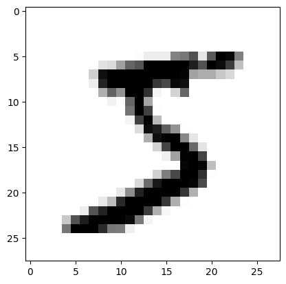
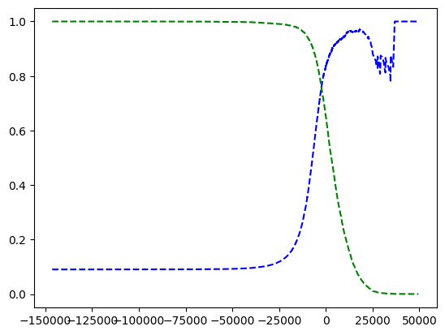
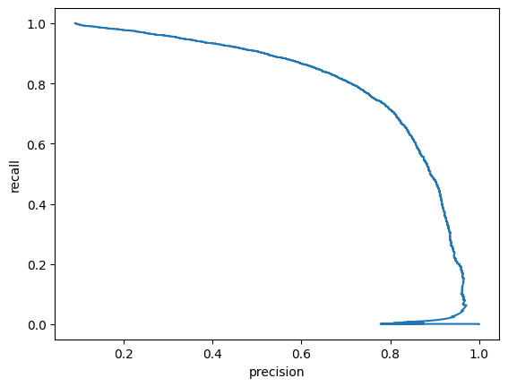
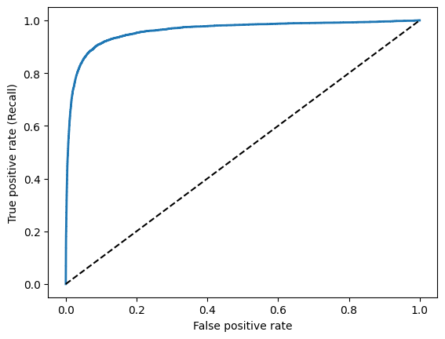

```python
#Supervised classification to predict classes

from sklearn.datasets import fetch_openml
mnist = fetch_openml('mnist_784', version=1)
mnist.keys()

#DESCR = described dataset
#data= contains array with one row per instance and one column per feature
#target = contains array with labels
```

    /home/test/ml/env/lib/python3.8/site-packages/sklearn/datasets/_openml.py:968: FutureWarning: The default value of `parser` will change from `'liac-arff'` to `'auto'` in 1.4. You can set `parser='auto'` to silence this warning. Therefore, an `ImportError` will be raised from 1.4 if the dataset is dense and pandas is not installed. Note that the pandas parser may return different data types. See the Notes Section in fetch_openml's API doc for details.
      warn(


    dict_keys(['data', 'target', 'frame', 'categories', 'feature_names', 'target_names', 'DESCR', 'details', 'url'])


```python
import numpy as np

#Looking at the arrays
(x,y) = (np.array(mnist["data"]), np.array(mnist["target"]))
x.shape

#There are 70000 images, each one has 784 features 28px x 28px each 
#Each pixel represents a pixel's intensity in the image
```


    (70000, 784)


```python
import matplotlib as mpl
import matplotlib.pyplot as plt
import numpy as np

some_digit = x[0]
some_digit_image = some_digit.reshape(28, 28)

plt.imshow(some_digit_image, cmap = mpl.cm.binary, interpolation="nearest")

print("This is a: " + y[0])
```

    This is a: 5


    

    


```python
#labels are represented as strings, let convert them to intergers
y = y.astype(np.uint8)
```


```python
#Training a binary classifier to classify one digit in the set, the number 5

#Make a test set, it's already shuffled and set up for us
((x_train, x_test), (y_train, y_test)) = ((x[:60000],x[60000:]), (y[:60000],y[60000:]))

#Target vectors
#boolean array where if 5 then true otherwise flase
y_train_5 = (y_train == 5)
y_test_5 = (y_test == 5)
```


```python
#Pick a classifier and train it
#Using a Stochastic Gradient Descent (SGD) classifier

from sklearn.linear_model import SGDClassifier

sgd_clf = SGDClassifier(random_state=42)
sgd_clf.fit(x_train, y_train_5)

#Use it to detect images of the number 5
print(sgd_clf.predict([some_digit]))
```

    [ True]


```python
#Cross validate using the cross_val_score() function which performs k-fold cross validation

from sklearn.model_selection import cross_val_score

cross_val_score(sgd_clf, x_train, y_train_5, cv=3, scoring="accuracy")
```


    array([0.95035, 0.96035, 0.9604 ])


```python
#It can be difficult to tell how accurate a classifier will be, so lets looks at the confusion matrix
#First we need to generate from predictions, lets use k-fold cross validation

from sklearn.model_selection import cross_val_predict

y_train_pred = cross_val_predict(sgd_clf, x_train, y_train_5, cv=3)
```


```python
#Make the confusion matrix
#each row is an actual class
#each column is a predicted class

from sklearn.metrics import confusion_matrix

confusion_matrix(y_train_5, y_train_pred)

#Is it a 5?
# 53892 True negatives (correctly classified as non 5's)
# 687 False positive (wrongly classified as 5's)
# 1891 False negatives (wrongly classified as non 5's)
# 3530 True positives (correctly classified as 5's)
```


    array([[53892,   687],
           [ 1891,  3530]])


```python
#The confusion matrix helps us out a lot, but lets look at a more precise overview of the accuracy 
#of the positive predictions (precision of the classifier)

#                TP
#precision =  --------
#             TP + FP

#                TP
#recall =     --------
#             TP + FN

from sklearn.metrics import precision_score, recall_score


print(precision_score(y_train_5, y_train_pred), recall_score(y_train_5, y_train_pred))

#Correctly predicts 5's 83% of the time
#Detects 65% of the 5's (pretty bad)
```

    0.8370879772350012 0.6511713705958311


```python
#lets see the F_1 score, see the relationship between precision and recall in one value (higher is better)

#           2               p * r          TP
# F_1 = --------- = 2 * ------------ = -----------
#        1     1            p + r             FN+FP
#       --- + ---                        TP + -----
#        p     r                                2

from sklearn.metrics import f1_score

f1_score(y_train_5, y_train_pred)
```


    0.7325171197343846


```python
#Get scores of all instances in the training set, return decision scores

y_scores = cross_val_predict(sgd_clf, x_train, y_train_5, cv=3, method="decision_function")

y_scores
```


    array([  1200.93051237, -26883.79202424, -33072.03475406, ...,
            13272.12718981,  -7258.47203373, -16877.50840447])


```python
#Lets look at the precision/recall trade-off
from sklearn.metrics import precision_recall_curve

(precisions, recalls, thresholds) = precision_recall_curve(y_train_5, y_scores)

#Plot the prexcision and recall against the decision threshold
def plot_precision_recall_vs_threshold(precisions, recalls, threasholds):
    plt.plot(thresholds, precisions[:-1], "b--", label="Precision")
    plt.plot(thresholds, recalls[:-1], "g--", label="Recall")
    [...]
    
plot_precision_recall_vs_threshold(precisions, recalls, thresholds)
plt.show()
```


    

    


```python
#Another simpler way to look at the relationship between recall and precision is to simply plot the
#recall against precision directly

plt.plot(precisions, recalls)
plt.xlabel("precision")
plt.ylabel("recall")
plt.show()
```


    

    


```python
#Add a threshold to get around 90% precision

threshold_90_precision = thresholds[np.argmax(precisions >= 0.90)]
y_train_pred_90 = (y_scores >= threshold_90_precision) #make predictions

#Check again the precision and recall
print(precision_score(y_train_5, y_train_pred_90), recall_score(y_train_5, y_train_pred_90))

#We can get any precision we want given a threshold, but at the expense of the recall (now at 47%)
```

    0.9000345901072293 0.4799852425751706


```python
#The ROC curve (plots recall against false positive rate, the ratio of negative instances that
#are incorrectly classified as positive

#to plot the ROC curve we need the TPR and FPR
from sklearn.metrics import roc_curve

(fpr, tpr, thresholds) = roc_curve(y_train_5, y_scores)

def plot_roc_curve(fpr, tpr, xlabel, ylabel):
    plt.xlabel(xlabel)
    plt.ylabel(ylabel)
    plt.plot(fpr, tpr, linewidth=2)
    plt.plot([0, 1], [0, 1], 'k--') #dashed diagonal
    [...]
    
plot_roc_curve(fpr, tpr, "False positive rate", "True positive rate (Recall)")
plt.show()

#The black dotted line represents a purely random classifier, a good classifier stays away from it
#We see the FPR increase as the TPR increases (more false positives when hicher the recall)
```


    

    


```python
#One way to compare classifiers is the measure the area under the curve (AUC)
#A perfect classifier will have an ROC AUC of 1 and a purely random one will have ROC AUC of 0.5
from sklearn.metrics import roc_auc_score

roc_auc_score(y_train_5, y_scores)
```


    0.9604938554008616


```python
#Lets compare the 'SGDClassifier' we just used with a 'RandomForestClassifier'
from sklearn.ensemble import RandomForestClassifier

forest_clf = RandomForestClassifier(random_state=42)
y_probas_forest = cross_val_predict(forest_clf, x_train, y_train_5, cv=3, method="predict_proba")

#You need scores to plot a ROC curve, not probabilities, lets use the positive class's probability as the score
y_scores_forest = y_probas_forest[:, 1]
(fpr_forest, tpr_forest, threshold_forest) = roc_curve(y_train_5, y_scores_forest)
```


```python
#Lets plot them and see how they compare
plt.plot(fpr, tpr, "b:", label="SGD")
plt_roc_curve(fpr_forest, tpr_forest, "Random Forest")
plt.legend(loc="lower right")
plt.show()
```


```python
#Lets recognize more than just 5's by using multiclass classifying
#Scikit detects when a binary is used for multi-class classification and usualyl uses One vs all

sgd_clf.fit(x_train, y_train)
sgd_clf.predict([some_digit])

#This trains the SDGClassifier on the training set 'y_train' (digits from 0 to 9)
#Returns 10 scores, one per class
some_digit_score = sgd_clf.decision_function([some_digit])
some_digit_score
```


    array([[-31893.03095419, -34419.69069632,  -9530.63950739,
              1823.73154031, -22320.14822878,  -1385.80478895,
            -26188.91070951, -16147.51323997,  -4604.35491274,
            -12050.767298  ]])


```python
#Random forest classifiers already classify instances into multiple classes

forest_clf.fit(x_train, y_train)
forest_clf.predict([some_digit])
```


    array([5], dtype=uint8)


```python
#Once again, lets evaluate these classifiers
cross_val_score(sgd_clf, x_train, y_train, cv=3, scoring="accuracy")
```


    array([0.87365, 0.85835, 0.8689 ])


```python
#We can scale the inputs and get a higher score
from sklearn.preprocessing import StandardScaler

scaler = StandardScaler()
x_train_scaled = scaler.fit_transform(x_train.astype(np.float64))
cross_val_score(sgd_clf, x_train_scaled, y_train, cv=3, scoring="accuracy")
```


    array([0.8983, 0.891 , 0.9018])


```python
#When there's a lot of data, a confusion matrix may be too confusing to look at - we can
#instead use an image representation

y_train_pred = cross_val_predicts(sgd_clf, x_train_scaled, y_train, cv=3)
conf_mx = confusion_matrix(y_train, y_train_pred)
plt.matshow(conf_mx, cmap=plt.cm.gray)
plt.show()
```


```python

```
