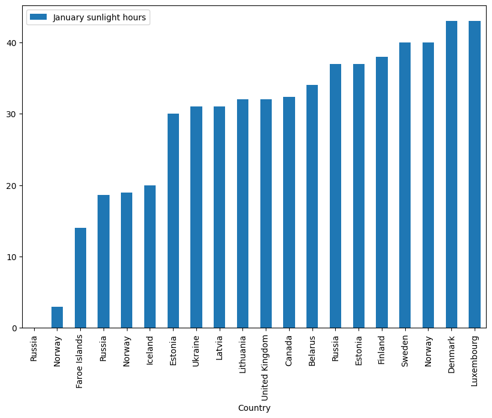

# Predict year mean sunshine hours

## Key aspects

**1)** Loading data from a CSV file that contains sunshine duration across different months for various countries and cities.

**2)** The dataset consists of 392 entries with some missing values in the 'Sep' column.

**3)** Creation of a training and testing set for machine learning or statistical analysis.

**4)** Visualization of the data is performed to understand the distribution of sunshine hours across different countries and cities.

**5)** Grouping and averaging sunshine duration data by country to facilitate comparisons.

**6)** Correlation analysis to understand the relationship between monthly sunshine hours and annual averages.
The use of scatter matrix plots to visualize potential correlations between variables.

**7)** Uses a linear regression model to analyze and predict sunshine duration, and evaluates the model's performance using standard metrics like RMSE

```python
#Load the data

import os
import pandas as pd

ROOT_DIR = "/home/test/ml/env/bin/sunshine.csv"

def load_sunshine_data(path):
    return pd.read_csv(path)

#15 attributes, each row is a country
#Country, City -> Attributes
#All other attributes -> Floats
#Very small data set of 391 entries
#Atribute 'Sep' is missing 14 entries

sunshineData = load_sunshine_data(ROOT_DIR)
sunshineData.info()
```

    <class 'pandas.core.frame.DataFrame'>
    RangeIndex: 392 entries, 0 to 391
    Data columns (total 15 columns):
     #   Column   Non-Null Count  Dtype  
    ---  ------   --------------  -----  
     0   Country  392 non-null    object 
     1   City     392 non-null    object 
     2   Jan      392 non-null    float64
     3   Feb      392 non-null    float64
     4   Mar      392 non-null    float64
     5   Apr      392 non-null    float64
     6   May      392 non-null    float64
     7   Jun      392 non-null    float64
     8   Jul      392 non-null    float64
     9   Aug      392 non-null    float64
     10  Sep      378 non-null    float64
     11  Oct      392 non-null    float64
     12  Nov      392 non-null    float64
     13  Dec      392 non-null    float64
     14  Year     392 non-null    float64
    dtypes: float64(13), object(2)
    memory usage: 46.1+ KB


```python
#Make a test set
from sklearn.model_selection import train_test_split

(train_set, test_set) = train_test_split(sunshineData, test_size=0.2, random_state=42)
```


```python
#Find the different categories of the 'Country' attribute
sunshineData.head()
```


<div>
<style scoped>
    .dataframe tbody tr th:only-of-type {
        vertical-align: middle;
    }

    .dataframe tbody tr th {
        vertical-align: top;
    }

    .dataframe thead th {
        text-align: right;
    }
</style>
<table border="1" class="dataframe">
  <thead>
    <tr style="text-align: right;">
      <th></th>
      <th>Country</th>
      <th>City</th>
      <th>Jan</th>
      <th>Feb</th>
      <th>Mar</th>
      <th>Apr</th>
      <th>May</th>
      <th>Jun</th>
      <th>Jul</th>
      <th>Aug</th>
      <th>Sep</th>
      <th>Oct</th>
      <th>Nov</th>
      <th>Dec</th>
      <th>Year</th>
    </tr>
  </thead>
  <tbody>
    <tr>
      <th>0</th>
      <td>Ivory Coast</td>
      <td>Gagnoa</td>
      <td>183.0</td>
      <td>180.0</td>
      <td>196.0</td>
      <td>188.0</td>
      <td>181.0</td>
      <td>118.0</td>
      <td>97.0</td>
      <td>80.0</td>
      <td>110.0</td>
      <td>155.0</td>
      <td>171.0</td>
      <td>164.0</td>
      <td>1823.0</td>
    </tr>
    <tr>
      <th>1</th>
      <td>Ivory Coast</td>
      <td>Bouaké</td>
      <td>242.0</td>
      <td>224.0</td>
      <td>219.0</td>
      <td>194.0</td>
      <td>208.0</td>
      <td>145.0</td>
      <td>104.0</td>
      <td>82.0</td>
      <td>115.0</td>
      <td>170.0</td>
      <td>191.0</td>
      <td>198.0</td>
      <td>2092.0</td>
    </tr>
    <tr>
      <th>2</th>
      <td>Ivory Coast</td>
      <td>Abidjan</td>
      <td>223.0</td>
      <td>223.0</td>
      <td>239.0</td>
      <td>214.0</td>
      <td>205.0</td>
      <td>128.0</td>
      <td>137.0</td>
      <td>125.0</td>
      <td>139.0</td>
      <td>215.0</td>
      <td>224.0</td>
      <td>224.0</td>
      <td>2296.0</td>
    </tr>
    <tr>
      <th>3</th>
      <td>Ivory Coast</td>
      <td>Odienné</td>
      <td>242.0</td>
      <td>220.2</td>
      <td>217.3</td>
      <td>214.7</td>
      <td>248.8</td>
      <td>221.8</td>
      <td>183.5</td>
      <td>174.5</td>
      <td>185.4</td>
      <td>235.8</td>
      <td>252.0</td>
      <td>242.6</td>
      <td>2638.6</td>
    </tr>
    <tr>
      <th>4</th>
      <td>Ivory Coast</td>
      <td>Ferké</td>
      <td>279.0</td>
      <td>249.0</td>
      <td>253.0</td>
      <td>229.0</td>
      <td>251.0</td>
      <td>221.0</td>
      <td>183.0</td>
      <td>151.0</td>
      <td>173.0</td>
      <td>245.0</td>
      <td>261.0</td>
      <td>262.0</td>
      <td>2757.0</td>
    </tr>
  </tbody>
</table>
</div>


```python
#Sort the Countries Based on Sunshine recieved in month Jan and plot the first 20 Country.

sunshineJan = sunshineData.sort_values("Jan")
sunshineJan = sunshineJan.drop(["Feb","Mar","Apr","May","Jun","Jul","Aug","Sep","Oct","Nov","Dec","Year","City"], axis=1)
sunshineJan.head(20)
```


<div>
<style scoped>
    .dataframe tbody tr th:only-of-type {
        vertical-align: middle;
    }

    .dataframe tbody tr th {
        vertical-align: top;
    }

    .dataframe thead th {
        text-align: right;
    }
</style>
<table border="1" class="dataframe">
  <thead>
    <tr style="text-align: right;">
      <th></th>
      <th>Country</th>
      <th>Jan</th>
    </tr>
  </thead>
  <tbody>
    <tr>
      <th>159</th>
      <td>Russia</td>
      <td>0.0</td>
    </tr>
    <tr>
      <th>228</th>
      <td>Norway</td>
      <td>3.0</td>
    </tr>
    <tr>
      <th>200</th>
      <td>Faroe Islands</td>
      <td>14.0</td>
    </tr>
    <tr>
      <th>164</th>
      <td>Russia</td>
      <td>18.6</td>
    </tr>
    <tr>
      <th>226</th>
      <td>Norway</td>
      <td>19.0</td>
    </tr>
    <tr>
      <th>211</th>
      <td>Iceland</td>
      <td>20.0</td>
    </tr>
    <tr>
      <th>198</th>
      <td>Estonia</td>
      <td>30.0</td>
    </tr>
    <tr>
      <th>253</th>
      <td>Ukraine</td>
      <td>31.0</td>
    </tr>
    <tr>
      <th>217</th>
      <td>Latvia</td>
      <td>31.0</td>
    </tr>
    <tr>
      <th>218</th>
      <td>Lithuania</td>
      <td>32.0</td>
    </tr>
    <tr>
      <th>255</th>
      <td>United Kingdom</td>
      <td>32.0</td>
    </tr>
    <tr>
      <th>260</th>
      <td>Canada</td>
      <td>32.4</td>
    </tr>
    <tr>
      <th>187</th>
      <td>Belarus</td>
      <td>34.0</td>
    </tr>
    <tr>
      <th>234</th>
      <td>Russia</td>
      <td>37.0</td>
    </tr>
    <tr>
      <th>199</th>
      <td>Estonia</td>
      <td>37.0</td>
    </tr>
    <tr>
      <th>201</th>
      <td>Finland</td>
      <td>38.0</td>
    </tr>
    <tr>
      <th>247</th>
      <td>Sweden</td>
      <td>40.0</td>
    </tr>
    <tr>
      <th>227</th>
      <td>Norway</td>
      <td>40.0</td>
    </tr>
    <tr>
      <th>197</th>
      <td>Denmark</td>
      <td>43.0</td>
    </tr>
    <tr>
      <th>219</th>
      <td>Luxembourg</td>
      <td>43.0</td>
    </tr>
  </tbody>
</table>
</div>


```python
(sunshineJan.iloc[:20]).plot(kind="bar", x="Country", y="Jan", label="January sunlight hours", figsize=(10,7))
```


    <Axes: xlabel='Country'>


    

    


```python
#Sort the City Based on the Sunshine recieved and plot the first 20 Country who recieved the most sunshine during the whole

sunshineJan = sunshineData.sort_values("Year")
sunshineJan = sunshineJan.drop(["Jan","Feb","Mar","Apr","May","Jun","Jul","Aug","Sep","Oct","Nov","Dec","Country"], axis=1)
sunshineJan = sunshineJan.sort_values("Year", ascending=False)
sunshineJan.head(20)
```


<div>
<style scoped>
    .dataframe tbody tr th:only-of-type {
        vertical-align: middle;
    }

    .dataframe tbody tr th {
        vertical-align: top;
    }

    .dataframe thead th {
        text-align: right;
    }
</style>
<table border="1" class="dataframe">
  <thead>
    <tr style="text-align: right;">
      <th></th>
      <th>City</th>
      <th>Year</th>
    </tr>
  </thead>
  <tbody>
    <tr>
      <th>329</th>
      <td>Yuma</td>
      <td>4015.3</td>
    </tr>
    <tr>
      <th>52</th>
      <td>Marsa Alam</td>
      <td>3958.0</td>
    </tr>
    <tr>
      <th>50</th>
      <td>Dakhla Oasis</td>
      <td>3943.4</td>
    </tr>
    <tr>
      <th>349</th>
      <td>Calama</td>
      <td>3926.2</td>
    </tr>
    <tr>
      <th>311</th>
      <td>Phoenix</td>
      <td>3871.6</td>
    </tr>
    <tr>
      <th>109</th>
      <td>Keetmanshoop</td>
      <td>3870.0</td>
    </tr>
    <tr>
      <th>297</th>
      <td>Las Vegas</td>
      <td>3825.3</td>
    </tr>
    <tr>
      <th>324</th>
      <td>Tucson</td>
      <td>3806.0</td>
    </tr>
    <tr>
      <th>290</th>
      <td>El Paso</td>
      <td>3762.5</td>
    </tr>
    <tr>
      <th>25</th>
      <td>Khartoum</td>
      <td>3737.1</td>
    </tr>
    <tr>
      <th>79</th>
      <td>Upington</td>
      <td>3731.8</td>
    </tr>
    <tr>
      <th>42</th>
      <td>Tamanrasset</td>
      <td>3686.0</td>
    </tr>
    <tr>
      <th>97</th>
      <td>Toliara</td>
      <td>3610.0</td>
    </tr>
    <tr>
      <th>316</th>
      <td>Sacramento</td>
      <td>3607.8</td>
    </tr>
    <tr>
      <th>110</th>
      <td>Windhoek</td>
      <td>3605.0</td>
    </tr>
    <tr>
      <th>58</th>
      <td>Lodwar</td>
      <td>3582.0</td>
    </tr>
    <tr>
      <th>48</th>
      <td>Alexandria</td>
      <td>3579.5</td>
    </tr>
    <tr>
      <th>83</th>
      <td>Ghanzi</td>
      <td>3579.0</td>
    </tr>
    <tr>
      <th>369</th>
      <td>Tennant Creek</td>
      <td>3565.5</td>
    </tr>
    <tr>
      <th>291</th>
      <td>Fresno</td>
      <td>3564.2</td>
    </tr>
  </tbody>
</table>
</div>


```python
(sunshineJan.iloc[:20]).plot(kind="bar", x="City", y="Year", label="Sunlight hours", figsize=(10,7))
```


    <Axes: xlabel='City'>


    

    


```python
australia_data = sunshineData[sunshineData['Country'] == 'United Kingdom']

import seaborn as sns
import matplotlib.pyplot as plt

months = ["Jan", "Feb", "Mar", "Apr", "May", "Jun", "Jul", "Aug", "Sep", "Oct", "Nov", "Dec"]  # Specify the months you want to plot

# Create an empty list to store the combined data frames
combined_data = []

# Iterate over the months and append the corresponding data frames to the list
for month in months:
    data = australia_data[['City', month]].copy()
    data.rename(columns={month: 'Sunlight hours'}, inplace=True)
    data['Month'] = month
    combined_data.append(data)

# Concatenate the data frames in the list into a single data frame
combined_data = pd.concat(combined_data)

# Plot the combined data
plt.figure(figsize=(20, 15))
sns.barplot(data=combined_data, x='City', y='Sunlight hours', hue='Month')
plt.xlabel('City')
plt.ylabel('Sunlight hours')
plt.title('Sunlight hours in Australia by Month')
plt.legend(title='Month')
plt.show()
```


    

    


```python
sunshineNoCity = sunshineData.drop("City", axis=1)
sunshineNoCity
```


<div>
<style scoped>
    .dataframe tbody tr th:only-of-type {
        vertical-align: middle;
    }

    .dataframe tbody tr th {
        vertical-align: top;
    }

    .dataframe thead th {
        text-align: right;
    }
</style>
<table border="1" class="dataframe">
  <thead>
    <tr style="text-align: right;">
      <th></th>
      <th>Country</th>
      <th>Jan</th>
      <th>Feb</th>
      <th>Mar</th>
      <th>Apr</th>
      <th>May</th>
      <th>Jun</th>
      <th>Jul</th>
      <th>Aug</th>
      <th>Sep</th>
      <th>Oct</th>
      <th>Nov</th>
      <th>Dec</th>
      <th>Year</th>
    </tr>
  </thead>
  <tbody>
    <tr>
      <th>0</th>
      <td>Ivory Coast</td>
      <td>183.0</td>
      <td>180.0</td>
      <td>196.0</td>
      <td>188.0</td>
      <td>181.0</td>
      <td>118.0</td>
      <td>97.0</td>
      <td>80.0</td>
      <td>110.0</td>
      <td>155.0</td>
      <td>171.0</td>
      <td>164.0</td>
      <td>1823.0</td>
    </tr>
    <tr>
      <th>1</th>
      <td>Ivory Coast</td>
      <td>242.0</td>
      <td>224.0</td>
      <td>219.0</td>
      <td>194.0</td>
      <td>208.0</td>
      <td>145.0</td>
      <td>104.0</td>
      <td>82.0</td>
      <td>115.0</td>
      <td>170.0</td>
      <td>191.0</td>
      <td>198.0</td>
      <td>2092.0</td>
    </tr>
    <tr>
      <th>2</th>
      <td>Ivory Coast</td>
      <td>223.0</td>
      <td>223.0</td>
      <td>239.0</td>
      <td>214.0</td>
      <td>205.0</td>
      <td>128.0</td>
      <td>137.0</td>
      <td>125.0</td>
      <td>139.0</td>
      <td>215.0</td>
      <td>224.0</td>
      <td>224.0</td>
      <td>2296.0</td>
    </tr>
    <tr>
      <th>3</th>
      <td>Ivory Coast</td>
      <td>242.0</td>
      <td>220.2</td>
      <td>217.3</td>
      <td>214.7</td>
      <td>248.8</td>
      <td>221.8</td>
      <td>183.5</td>
      <td>174.5</td>
      <td>185.4</td>
      <td>235.8</td>
      <td>252.0</td>
      <td>242.6</td>
      <td>2638.6</td>
    </tr>
    <tr>
      <th>4</th>
      <td>Ivory Coast</td>
      <td>279.0</td>
      <td>249.0</td>
      <td>253.0</td>
      <td>229.0</td>
      <td>251.0</td>
      <td>221.0</td>
      <td>183.0</td>
      <td>151.0</td>
      <td>173.0</td>
      <td>245.0</td>
      <td>261.0</td>
      <td>262.0</td>
      <td>2757.0</td>
    </tr>
    <tr>
      <th>...</th>
      <td>...</td>
      <td>...</td>
      <td>...</td>
      <td>...</td>
      <td>...</td>
      <td>...</td>
      <td>...</td>
      <td>...</td>
      <td>...</td>
      <td>...</td>
      <td>...</td>
      <td>...</td>
      <td>...</td>
      <td>...</td>
    </tr>
    <tr>
      <th>387</th>
      <td>New Zealand</td>
      <td>240.3</td>
      <td>205.0</td>
      <td>194.7</td>
      <td>153.8</td>
      <td>126.0</td>
      <td>102.3</td>
      <td>111.4</td>
      <td>137.2</td>
      <td>163.2</td>
      <td>191.1</td>
      <td>210.8</td>
      <td>222.9</td>
      <td>2058.7</td>
    </tr>
    <tr>
      <th>388</th>
      <td>New Zealand</td>
      <td>229.8</td>
      <td>192.9</td>
      <td>193.3</td>
      <td>165.1</td>
      <td>138.3</td>
      <td>112.8</td>
      <td>126.4</td>
      <td>144.1</td>
      <td>147.5</td>
      <td>174.8</td>
      <td>187.1</td>
      <td>207.6</td>
      <td>2019.6</td>
    </tr>
    <tr>
      <th>389</th>
      <td>New Zealand</td>
      <td>228.8</td>
      <td>194.9</td>
      <td>189.2</td>
      <td>157.3</td>
      <td>139.8</td>
      <td>110.3</td>
      <td>128.1</td>
      <td>142.9</td>
      <td>148.6</td>
      <td>178.1</td>
      <td>188.1</td>
      <td>197.2</td>
      <td>2003.1</td>
    </tr>
    <tr>
      <th>390</th>
      <td>Fiji</td>
      <td>192.2</td>
      <td>178.0</td>
      <td>170.5</td>
      <td>153.0</td>
      <td>145.7</td>
      <td>141.0</td>
      <td>136.4</td>
      <td>142.6</td>
      <td>135.0</td>
      <td>164.3</td>
      <td>168.0</td>
      <td>195.3</td>
      <td>1922.0</td>
    </tr>
    <tr>
      <th>391</th>
      <td>New Zealand</td>
      <td>179.6</td>
      <td>158.0</td>
      <td>146.1</td>
      <td>125.9</td>
      <td>108.4</td>
      <td>95.3</td>
      <td>110.6</td>
      <td>122.2</td>
      <td>136.8</td>
      <td>165.5</td>
      <td>166.9</td>
      <td>168.3</td>
      <td>1683.7</td>
    </tr>
  </tbody>
</table>
<p>392 rows × 14 columns</p>
</div>


```python
grouped_data = sunshineNoCity.groupby('Country').mean()

# Reset the index to convert the grouped 'Country' column into a regular column
grouped_data.reset_index(inplace=True)
grouped_data
```


<div>
<style scoped>
    .dataframe tbody tr th:only-of-type {
        vertical-align: middle;
    }

    .dataframe tbody tr th {
        vertical-align: top;
    }

    .dataframe thead th {
        text-align: right;
    }
</style>
<table border="1" class="dataframe">
  <thead>
    <tr style="text-align: right;">
      <th></th>
      <th>Country</th>
      <th>Jan</th>
      <th>Feb</th>
      <th>Mar</th>
      <th>Apr</th>
      <th>May</th>
      <th>Jun</th>
      <th>Jul</th>
      <th>Aug</th>
      <th>Sep</th>
      <th>Oct</th>
      <th>Nov</th>
      <th>Dec</th>
      <th>Year</th>
    </tr>
  </thead>
  <tbody>
    <tr>
      <th>0</th>
      <td>Afghanistan</td>
      <td>177.200000</td>
      <td>178.600000</td>
      <td>204.500000</td>
      <td>232.500000</td>
      <td>310.300000</td>
      <td>353.400000</td>
      <td>356.800000</td>
      <td>339.70</td>
      <td>NaN</td>
      <td>282.600000</td>
      <td>253.200000</td>
      <td>182.400000</td>
      <td>3175.100000</td>
    </tr>
    <tr>
      <th>1</th>
      <td>Albania</td>
      <td>124.000000</td>
      <td>125.000000</td>
      <td>165.000000</td>
      <td>191.000000</td>
      <td>263.000000</td>
      <td>298.000000</td>
      <td>354.000000</td>
      <td>327.00</td>
      <td>264.000000</td>
      <td>218.000000</td>
      <td>127.000000</td>
      <td>88.000000</td>
      <td>2544.000000</td>
    </tr>
    <tr>
      <th>2</th>
      <td>Algeria</td>
      <td>223.300000</td>
      <td>220.250000</td>
      <td>262.200000</td>
      <td>292.500000</td>
      <td>323.800000</td>
      <td>312.000000</td>
      <td>353.250000</td>
      <td>325.35</td>
      <td>262.500000</td>
      <td>269.500000</td>
      <td>225.000000</td>
      <td>204.400000</td>
      <td>3266.500000</td>
    </tr>
    <tr>
      <th>3</th>
      <td>Angola</td>
      <td>219.000000</td>
      <td>208.000000</td>
      <td>213.000000</td>
      <td>199.000000</td>
      <td>233.000000</td>
      <td>223.000000</td>
      <td>175.000000</td>
      <td>150.00</td>
      <td>145.000000</td>
      <td>164.000000</td>
      <td>199.000000</td>
      <td>212.000000</td>
      <td>2341.000000</td>
    </tr>
    <tr>
      <th>4</th>
      <td>Argentina</td>
      <td>238.250000</td>
      <td>207.066667</td>
      <td>185.050000</td>
      <td>170.616667</td>
      <td>151.466667</td>
      <td>123.383333</td>
      <td>138.616667</td>
      <td>170.40</td>
      <td>174.600000</td>
      <td>208.566667</td>
      <td>222.833333</td>
      <td>229.450000</td>
      <td>2220.300000</td>
    </tr>
    <tr>
      <th>...</th>
      <td>...</td>
      <td>...</td>
      <td>...</td>
      <td>...</td>
      <td>...</td>
      <td>...</td>
      <td>...</td>
      <td>...</td>
      <td>...</td>
      <td>...</td>
      <td>...</td>
      <td>...</td>
      <td>...</td>
      <td>...</td>
    </tr>
    <tr>
      <th>136</th>
      <td>Uzbekistan</td>
      <td>117.800000</td>
      <td>127.100000</td>
      <td>164.300000</td>
      <td>216.000000</td>
      <td>303.800000</td>
      <td>363.000000</td>
      <td>384.400000</td>
      <td>365.80</td>
      <td>300.000000</td>
      <td>226.300000</td>
      <td>150.000000</td>
      <td>105.400000</td>
      <td>2823.900000</td>
    </tr>
    <tr>
      <th>137</th>
      <td>Venezuela</td>
      <td>259.133333</td>
      <td>243.900000</td>
      <td>261.700000</td>
      <td>224.666667</td>
      <td>217.400000</td>
      <td>212.333333</td>
      <td>248.100000</td>
      <td>248.00</td>
      <td>245.833333</td>
      <td>251.400000</td>
      <td>239.000000</td>
      <td>243.933333</td>
      <td>2895.300000</td>
    </tr>
    <tr>
      <th>138</th>
      <td>Vietnam</td>
      <td>178.250000</td>
      <td>168.000000</td>
      <td>190.500000</td>
      <td>185.000000</td>
      <td>203.500000</td>
      <td>182.250000</td>
      <td>196.250000</td>
      <td>175.00</td>
      <td>161.750000</td>
      <td>158.500000</td>
      <td>157.250000</td>
      <td>167.000000</td>
      <td>2123.500000</td>
    </tr>
    <tr>
      <th>139</th>
      <td>Zambia</td>
      <td>180.833333</td>
      <td>168.933333</td>
      <td>221.133333</td>
      <td>254.000000</td>
      <td>286.233333</td>
      <td>278.000000</td>
      <td>300.700000</td>
      <td>306.90</td>
      <td>289.000000</td>
      <td>273.833333</td>
      <td>223.000000</td>
      <td>182.900000</td>
      <td>2965.466667</td>
    </tr>
    <tr>
      <th>140</th>
      <td>Zimbabwe</td>
      <td>230.950000</td>
      <td>201.600000</td>
      <td>241.800000</td>
      <td>250.500000</td>
      <td>274.350000</td>
      <td>265.500000</td>
      <td>283.650000</td>
      <td>300.70</td>
      <td>291.000000</td>
      <td>279.000000</td>
      <td>234.000000</td>
      <td>212.350000</td>
      <td>3065.400000</td>
    </tr>
  </tbody>
</table>
<p>141 rows × 14 columns</p>
</div>


```python
dropped_Country = grouped_data['Country'].unique().tolist()
dropped_Year = grouped_data['Year'].unique().tolist()
```


```python
#grouped_dataNoStr['Country'] = dropped_Country

grouped_dataNoStr = grouped_data.drop(["Country", "Year"], axis=1)
grouped_dataNoStr['Month_mean'] = grouped_dataNoStr.mean(axis=1)
grouped_dataNoStr
```


<div>
<style scoped>
    .dataframe tbody tr th:only-of-type {
        vertical-align: middle;
    }

    .dataframe tbody tr th {
        vertical-align: top;
    }

    .dataframe thead th {
        text-align: right;
    }
</style>
<table border="1" class="dataframe">
  <thead>
    <tr style="text-align: right;">
      <th></th>
      <th>Jan</th>
      <th>Feb</th>
      <th>Mar</th>
      <th>Apr</th>
      <th>May</th>
      <th>Jun</th>
      <th>Jul</th>
      <th>Aug</th>
      <th>Sep</th>
      <th>Oct</th>
      <th>Nov</th>
      <th>Dec</th>
      <th>Month_mean</th>
    </tr>
  </thead>
  <tbody>
    <tr>
      <th>0</th>
      <td>177.200000</td>
      <td>178.600000</td>
      <td>204.500000</td>
      <td>232.500000</td>
      <td>310.300000</td>
      <td>353.400000</td>
      <td>356.800000</td>
      <td>339.70</td>
      <td>NaN</td>
      <td>282.600000</td>
      <td>253.200000</td>
      <td>182.400000</td>
      <td>261.018182</td>
    </tr>
    <tr>
      <th>1</th>
      <td>124.000000</td>
      <td>125.000000</td>
      <td>165.000000</td>
      <td>191.000000</td>
      <td>263.000000</td>
      <td>298.000000</td>
      <td>354.000000</td>
      <td>327.00</td>
      <td>264.000000</td>
      <td>218.000000</td>
      <td>127.000000</td>
      <td>88.000000</td>
      <td>212.000000</td>
    </tr>
    <tr>
      <th>2</th>
      <td>223.300000</td>
      <td>220.250000</td>
      <td>262.200000</td>
      <td>292.500000</td>
      <td>323.800000</td>
      <td>312.000000</td>
      <td>353.250000</td>
      <td>325.35</td>
      <td>262.500000</td>
      <td>269.500000</td>
      <td>225.000000</td>
      <td>204.400000</td>
      <td>272.837500</td>
    </tr>
    <tr>
      <th>3</th>
      <td>219.000000</td>
      <td>208.000000</td>
      <td>213.000000</td>
      <td>199.000000</td>
      <td>233.000000</td>
      <td>223.000000</td>
      <td>175.000000</td>
      <td>150.00</td>
      <td>145.000000</td>
      <td>164.000000</td>
      <td>199.000000</td>
      <td>212.000000</td>
      <td>195.000000</td>
    </tr>
    <tr>
      <th>4</th>
      <td>238.250000</td>
      <td>207.066667</td>
      <td>185.050000</td>
      <td>170.616667</td>
      <td>151.466667</td>
      <td>123.383333</td>
      <td>138.616667</td>
      <td>170.40</td>
      <td>174.600000</td>
      <td>208.566667</td>
      <td>222.833333</td>
      <td>229.450000</td>
      <td>185.025000</td>
    </tr>
    <tr>
      <th>...</th>
      <td>...</td>
      <td>...</td>
      <td>...</td>
      <td>...</td>
      <td>...</td>
      <td>...</td>
      <td>...</td>
      <td>...</td>
      <td>...</td>
      <td>...</td>
      <td>...</td>
      <td>...</td>
      <td>...</td>
    </tr>
    <tr>
      <th>136</th>
      <td>117.800000</td>
      <td>127.100000</td>
      <td>164.300000</td>
      <td>216.000000</td>
      <td>303.800000</td>
      <td>363.000000</td>
      <td>384.400000</td>
      <td>365.80</td>
      <td>300.000000</td>
      <td>226.300000</td>
      <td>150.000000</td>
      <td>105.400000</td>
      <td>235.325000</td>
    </tr>
    <tr>
      <th>137</th>
      <td>259.133333</td>
      <td>243.900000</td>
      <td>261.700000</td>
      <td>224.666667</td>
      <td>217.400000</td>
      <td>212.333333</td>
      <td>248.100000</td>
      <td>248.00</td>
      <td>245.833333</td>
      <td>251.400000</td>
      <td>239.000000</td>
      <td>243.933333</td>
      <td>241.283333</td>
    </tr>
    <tr>
      <th>138</th>
      <td>178.250000</td>
      <td>168.000000</td>
      <td>190.500000</td>
      <td>185.000000</td>
      <td>203.500000</td>
      <td>182.250000</td>
      <td>196.250000</td>
      <td>175.00</td>
      <td>161.750000</td>
      <td>158.500000</td>
      <td>157.250000</td>
      <td>167.000000</td>
      <td>176.937500</td>
    </tr>
    <tr>
      <th>139</th>
      <td>180.833333</td>
      <td>168.933333</td>
      <td>221.133333</td>
      <td>254.000000</td>
      <td>286.233333</td>
      <td>278.000000</td>
      <td>300.700000</td>
      <td>306.90</td>
      <td>289.000000</td>
      <td>273.833333</td>
      <td>223.000000</td>
      <td>182.900000</td>
      <td>247.122222</td>
    </tr>
    <tr>
      <th>140</th>
      <td>230.950000</td>
      <td>201.600000</td>
      <td>241.800000</td>
      <td>250.500000</td>
      <td>274.350000</td>
      <td>265.500000</td>
      <td>283.650000</td>
      <td>300.70</td>
      <td>291.000000</td>
      <td>279.000000</td>
      <td>234.000000</td>
      <td>212.350000</td>
      <td>255.450000</td>
    </tr>
  </tbody>
</table>
<p>141 rows × 13 columns</p>
</div>


```python
grouped_dataNoStr['Country'] = dropped_Country
grouped_dataNoStr['Year'] = dropped_Year

column_names = {'Jan': 'Jan_mean', 'Feb': 'Feb_mean', "Mar": "Mar_mean", "Apr": "Apr_mean", "May": "May_mean", "Jun": "Jun_mean", "Jul": "Jul_mean", "Aug": "Aug_mean", "Sep": "Sep_mean", "Oct": "Oct_mean", "Nov": "Nov_mean", "Dec": "Dec_mean", "Year": "Year_mean"}

# Use the rename() method to rename the columns
grouped_dataNoStr.rename(columns=column_names, inplace=True)

grouped_dataNoStr.head()
```


<div>
<style scoped>
    .dataframe tbody tr th:only-of-type {
        vertical-align: middle;
    }

    .dataframe tbody tr th {
        vertical-align: top;
    }

    .dataframe thead th {
        text-align: right;
    }
</style>
<table border="1" class="dataframe">
  <thead>
    <tr style="text-align: right;">
      <th></th>
      <th>Jan_mean</th>
      <th>Feb_mean</th>
      <th>Mar_mean</th>
      <th>Apr_mean</th>
      <th>May_mean</th>
      <th>Jun_mean</th>
      <th>Jul_mean</th>
      <th>Aug_mean</th>
      <th>Sep_mean</th>
      <th>Oct_mean</th>
      <th>Nov_mean</th>
      <th>Dec_mean</th>
      <th>Month_mean</th>
      <th>Country</th>
      <th>Year_mean</th>
    </tr>
  </thead>
  <tbody>
    <tr>
      <th>0</th>
      <td>177.20</td>
      <td>178.600000</td>
      <td>204.50</td>
      <td>232.500000</td>
      <td>310.300000</td>
      <td>353.400000</td>
      <td>356.800000</td>
      <td>339.70</td>
      <td>NaN</td>
      <td>282.600000</td>
      <td>253.200000</td>
      <td>182.40</td>
      <td>261.018182</td>
      <td>Afghanistan</td>
      <td>3175.1</td>
    </tr>
    <tr>
      <th>1</th>
      <td>124.00</td>
      <td>125.000000</td>
      <td>165.00</td>
      <td>191.000000</td>
      <td>263.000000</td>
      <td>298.000000</td>
      <td>354.000000</td>
      <td>327.00</td>
      <td>264.0</td>
      <td>218.000000</td>
      <td>127.000000</td>
      <td>88.00</td>
      <td>212.000000</td>
      <td>Albania</td>
      <td>2544.0</td>
    </tr>
    <tr>
      <th>2</th>
      <td>223.30</td>
      <td>220.250000</td>
      <td>262.20</td>
      <td>292.500000</td>
      <td>323.800000</td>
      <td>312.000000</td>
      <td>353.250000</td>
      <td>325.35</td>
      <td>262.5</td>
      <td>269.500000</td>
      <td>225.000000</td>
      <td>204.40</td>
      <td>272.837500</td>
      <td>Algeria</td>
      <td>3266.5</td>
    </tr>
    <tr>
      <th>3</th>
      <td>219.00</td>
      <td>208.000000</td>
      <td>213.00</td>
      <td>199.000000</td>
      <td>233.000000</td>
      <td>223.000000</td>
      <td>175.000000</td>
      <td>150.00</td>
      <td>145.0</td>
      <td>164.000000</td>
      <td>199.000000</td>
      <td>212.00</td>
      <td>195.000000</td>
      <td>Angola</td>
      <td>2341.0</td>
    </tr>
    <tr>
      <th>4</th>
      <td>238.25</td>
      <td>207.066667</td>
      <td>185.05</td>
      <td>170.616667</td>
      <td>151.466667</td>
      <td>123.383333</td>
      <td>138.616667</td>
      <td>170.40</td>
      <td>174.6</td>
      <td>208.566667</td>
      <td>222.833333</td>
      <td>229.45</td>
      <td>185.025000</td>
      <td>Argentina</td>
      <td>2220.3</td>
    </tr>
  </tbody>
</table>
</div>


```python

```


```python
#Create a yearly sunshine hours category
#grouped_dataNoStr["Yearly_hour_cat"] = pd.cut(grouped_dataNoStr['Year_mean'], bins=[0.,])


corr_matrix = (grouped_dataNoStr.drop(["Country"], axis=1)).corr()
corr_matrix["Year_mean"].sort_values(ascending=False)
```


    Year_mean     1.000000
    Month_mean    0.999791
    Oct_mean      0.929960
    Apr_mean      0.872852
    Mar_mean      0.867340
    Sep_mean      0.827830
    Nov_mean      0.827036
    Feb_mean      0.770435
    Dec_mean      0.744026
    Jan_mean      0.734081
    May_mean      0.718235
    Jun_mean      0.570120
    Aug_mean      0.551966
    Jul_mean      0.455126
    Name: Year_mean, dtype: float64


```python

from pandas.plotting import scatter_matrix
attributes = ["Year_mean", "Month_mean"]
scatter_matrix(grouped_dataNoStr[attributes], figsize=(12, 8))
```


    array([[<Axes: xlabel='Year_mean', ylabel='Year_mean'>,
            <Axes: xlabel='Month_mean', ylabel='Year_mean'>],
           [<Axes: xlabel='Year_mean', ylabel='Month_mean'>,
            <Axes: xlabel='Month_mean', ylabel='Month_mean'>]], dtype=object)


    

    


```python
#Prepare data for machine learning
finalData = grouped_dataNoStr.drop("Country", axis=1)

predictors = finalData.drop("Year_mean", axis=1)
labels = finalData["Year_mean"].copy()

#fill missing values using SimpleImputer
from sklearn.impute import SimpleImputer

imputer = SimpleImputer(strategy="mean")
imputer.fit(predictors)

#imputer.statistics_

X = imputer.transform(predictors) #returns numpy array
predictors_tr = pd.DataFrame(X, columns=predictors.columns) #turn back to dataFrame object

#new set with filled missing values
predictors_tr
```


<div>
<style scoped>
    .dataframe tbody tr th:only-of-type {
        vertical-align: middle;
    }

    .dataframe tbody tr th {
        vertical-align: top;
    }

    .dataframe thead th {
        text-align: right;
    }
</style>
<table border="1" class="dataframe">
  <thead>
    <tr style="text-align: right;">
      <th></th>
      <th>Jan_mean</th>
      <th>Feb_mean</th>
      <th>Mar_mean</th>
      <th>Apr_mean</th>
      <th>May_mean</th>
      <th>Jun_mean</th>
      <th>Jul_mean</th>
      <th>Aug_mean</th>
      <th>Sep_mean</th>
      <th>Oct_mean</th>
      <th>Nov_mean</th>
      <th>Dec_mean</th>
      <th>Month_mean</th>
    </tr>
  </thead>
  <tbody>
    <tr>
      <th>0</th>
      <td>177.200000</td>
      <td>178.600000</td>
      <td>204.500000</td>
      <td>232.500000</td>
      <td>310.300000</td>
      <td>353.400000</td>
      <td>356.800000</td>
      <td>339.70</td>
      <td>206.991582</td>
      <td>282.600000</td>
      <td>253.200000</td>
      <td>182.400000</td>
      <td>261.018182</td>
    </tr>
    <tr>
      <th>1</th>
      <td>124.000000</td>
      <td>125.000000</td>
      <td>165.000000</td>
      <td>191.000000</td>
      <td>263.000000</td>
      <td>298.000000</td>
      <td>354.000000</td>
      <td>327.00</td>
      <td>264.000000</td>
      <td>218.000000</td>
      <td>127.000000</td>
      <td>88.000000</td>
      <td>212.000000</td>
    </tr>
    <tr>
      <th>2</th>
      <td>223.300000</td>
      <td>220.250000</td>
      <td>262.200000</td>
      <td>292.500000</td>
      <td>323.800000</td>
      <td>312.000000</td>
      <td>353.250000</td>
      <td>325.35</td>
      <td>262.500000</td>
      <td>269.500000</td>
      <td>225.000000</td>
      <td>204.400000</td>
      <td>272.837500</td>
    </tr>
    <tr>
      <th>3</th>
      <td>219.000000</td>
      <td>208.000000</td>
      <td>213.000000</td>
      <td>199.000000</td>
      <td>233.000000</td>
      <td>223.000000</td>
      <td>175.000000</td>
      <td>150.00</td>
      <td>145.000000</td>
      <td>164.000000</td>
      <td>199.000000</td>
      <td>212.000000</td>
      <td>195.000000</td>
    </tr>
    <tr>
      <th>4</th>
      <td>238.250000</td>
      <td>207.066667</td>
      <td>185.050000</td>
      <td>170.616667</td>
      <td>151.466667</td>
      <td>123.383333</td>
      <td>138.616667</td>
      <td>170.40</td>
      <td>174.600000</td>
      <td>208.566667</td>
      <td>222.833333</td>
      <td>229.450000</td>
      <td>185.025000</td>
    </tr>
    <tr>
      <th>...</th>
      <td>...</td>
      <td>...</td>
      <td>...</td>
      <td>...</td>
      <td>...</td>
      <td>...</td>
      <td>...</td>
      <td>...</td>
      <td>...</td>
      <td>...</td>
      <td>...</td>
      <td>...</td>
      <td>...</td>
    </tr>
    <tr>
      <th>136</th>
      <td>117.800000</td>
      <td>127.100000</td>
      <td>164.300000</td>
      <td>216.000000</td>
      <td>303.800000</td>
      <td>363.000000</td>
      <td>384.400000</td>
      <td>365.80</td>
      <td>300.000000</td>
      <td>226.300000</td>
      <td>150.000000</td>
      <td>105.400000</td>
      <td>235.325000</td>
    </tr>
    <tr>
      <th>137</th>
      <td>259.133333</td>
      <td>243.900000</td>
      <td>261.700000</td>
      <td>224.666667</td>
      <td>217.400000</td>
      <td>212.333333</td>
      <td>248.100000</td>
      <td>248.00</td>
      <td>245.833333</td>
      <td>251.400000</td>
      <td>239.000000</td>
      <td>243.933333</td>
      <td>241.283333</td>
    </tr>
    <tr>
      <th>138</th>
      <td>178.250000</td>
      <td>168.000000</td>
      <td>190.500000</td>
      <td>185.000000</td>
      <td>203.500000</td>
      <td>182.250000</td>
      <td>196.250000</td>
      <td>175.00</td>
      <td>161.750000</td>
      <td>158.500000</td>
      <td>157.250000</td>
      <td>167.000000</td>
      <td>176.937500</td>
    </tr>
    <tr>
      <th>139</th>
      <td>180.833333</td>
      <td>168.933333</td>
      <td>221.133333</td>
      <td>254.000000</td>
      <td>286.233333</td>
      <td>278.000000</td>
      <td>300.700000</td>
      <td>306.90</td>
      <td>289.000000</td>
      <td>273.833333</td>
      <td>223.000000</td>
      <td>182.900000</td>
      <td>247.122222</td>
    </tr>
    <tr>
      <th>140</th>
      <td>230.950000</td>
      <td>201.600000</td>
      <td>241.800000</td>
      <td>250.500000</td>
      <td>274.350000</td>
      <td>265.500000</td>
      <td>283.650000</td>
      <td>300.70</td>
      <td>291.000000</td>
      <td>279.000000</td>
      <td>234.000000</td>
      <td>212.350000</td>
      <td>255.450000</td>
    </tr>
  </tbody>
</table>
<p>141 rows × 13 columns</p>
</div>


```python
#Feature scaling ????

from sklearn.pipeline import Pipeline
from sklearn.preprocessing import StandardScaler

num_pipeline = Pipeline([
    ('imputer', SimpleImputer(strategy="mean")),
    ('std_scaler', StandardScaler()),
])

predictors_tr_num = num_pipeline.fit_transform(predictors)

predictors_tr_num_df = pd.DataFrame(predictors_tr_num, columns=predictors.columns) #turn back to dataFrame object
predictors_tr_num_df
```


<div>
<style scoped>
    .dataframe tbody tr th:only-of-type {
        vertical-align: middle;
    }

    .dataframe tbody tr th {
        vertical-align: top;
    }

    .dataframe thead th {
        text-align: right;
    }
</style>
<table border="1" class="dataframe">
  <thead>
    <tr style="text-align: right;">
      <th></th>
      <th>Jan_mean</th>
      <th>Feb_mean</th>
      <th>Mar_mean</th>
      <th>Apr_mean</th>
      <th>May_mean</th>
      <th>Jun_mean</th>
      <th>Jul_mean</th>
      <th>Aug_mean</th>
      <th>Sep_mean</th>
      <th>Oct_mean</th>
      <th>Nov_mean</th>
      <th>Dec_mean</th>
      <th>Month_mean</th>
    </tr>
  </thead>
  <tbody>
    <tr>
      <th>0</th>
      <td>0.068269</td>
      <td>0.112980</td>
      <td>0.072874</td>
      <td>0.417743</td>
      <td>1.308129</td>
      <td>1.810309</td>
      <td>1.539011</td>
      <td>1.548246</td>
      <td>0.000000</td>
      <td>1.287994</td>
      <td>0.990081</td>
      <td>0.204891</td>
      <td>1.158409</td>
    </tr>
    <tr>
      <th>1</th>
      <td>-0.562324</td>
      <td>-0.685269</td>
      <td>-0.623551</td>
      <td>-0.496151</td>
      <td>0.427735</td>
      <td>0.961256</td>
      <td>1.502163</td>
      <td>1.364009</td>
      <td>1.034506</td>
      <td>0.286037</td>
      <td>-0.592388</td>
      <td>-0.889952</td>
      <td>0.158656</td>
    </tr>
    <tr>
      <th>2</th>
      <td>0.614704</td>
      <td>0.733260</td>
      <td>1.090183</td>
      <td>1.739036</td>
      <td>1.559404</td>
      <td>1.175818</td>
      <td>1.492293</td>
      <td>1.340073</td>
      <td>1.007286</td>
      <td>1.084811</td>
      <td>0.636471</td>
      <td>0.460045</td>
      <td>1.399470</td>
    </tr>
    <tr>
      <th>3</th>
      <td>0.563735</td>
      <td>0.550825</td>
      <td>0.222737</td>
      <td>-0.319978</td>
      <td>-0.130654</td>
      <td>-0.188184</td>
      <td>-0.853460</td>
      <td>-1.203700</td>
      <td>-1.124933</td>
      <td>-0.551512</td>
      <td>0.310447</td>
      <td>0.548189</td>
      <td>-0.188068</td>
    </tr>
    <tr>
      <th>4</th>
      <td>0.791910</td>
      <td>0.536925</td>
      <td>-0.270049</td>
      <td>-0.945023</td>
      <td>-1.648231</td>
      <td>-1.714895</td>
      <td>-1.332261</td>
      <td>-0.907761</td>
      <td>-0.587795</td>
      <td>0.139724</td>
      <td>0.609302</td>
      <td>0.750572</td>
      <td>-0.391514</td>
    </tr>
    <tr>
      <th>...</th>
      <td>...</td>
      <td>...</td>
      <td>...</td>
      <td>...</td>
      <td>...</td>
      <td>...</td>
      <td>...</td>
      <td>...</td>
      <td>...</td>
      <td>...</td>
      <td>...</td>
      <td>...</td>
      <td>...</td>
    </tr>
    <tr>
      <th>136</th>
      <td>-0.635815</td>
      <td>-0.653994</td>
      <td>-0.635893</td>
      <td>0.054388</td>
      <td>1.187144</td>
      <td>1.957437</td>
      <td>1.902224</td>
      <td>1.926874</td>
      <td>1.687781</td>
      <td>0.414772</td>
      <td>-0.303982</td>
      <td>-0.688149</td>
      <td>0.634382</td>
    </tr>
    <tr>
      <th>137</th>
      <td>1.039446</td>
      <td>1.085473</td>
      <td>1.081367</td>
      <td>0.245241</td>
      <td>-0.421016</td>
      <td>-0.351660</td>
      <td>0.108529</td>
      <td>0.217970</td>
      <td>0.704843</td>
      <td>0.804077</td>
      <td>0.812022</td>
      <td>0.918549</td>
      <td>0.755906</td>
    </tr>
    <tr>
      <th>138</th>
      <td>0.080715</td>
      <td>-0.044883</td>
      <td>-0.173960</td>
      <td>-0.628280</td>
      <td>-0.679736</td>
      <td>-0.812713</td>
      <td>-0.573812</td>
      <td>-0.841029</td>
      <td>-0.820978</td>
      <td>-0.636818</td>
      <td>-0.213072</td>
      <td>0.026283</td>
      <td>-0.556463</td>
    </tr>
    <tr>
      <th>139</th>
      <td>0.111336</td>
      <td>-0.030983</td>
      <td>0.366136</td>
      <td>0.891207</td>
      <td>0.860177</td>
      <td>0.654739</td>
      <td>0.800740</td>
      <td>1.072422</td>
      <td>1.488169</td>
      <td>1.152022</td>
      <td>0.611392</td>
      <td>0.210690</td>
      <td>0.874993</td>
    </tr>
    <tr>
      <th>140</th>
      <td>0.705381</td>
      <td>0.455512</td>
      <td>0.730510</td>
      <td>0.814131</td>
      <td>0.638993</td>
      <td>0.463165</td>
      <td>0.576364</td>
      <td>0.982480</td>
      <td>1.524462</td>
      <td>1.232158</td>
      <td>0.749325</td>
      <td>0.552248</td>
      <td>1.044843</td>
    </tr>
  </tbody>
</table>
<p>141 rows × 13 columns</p>
</div>


```python
#Training and Evaluating on the Training Set

#Using linear regression
from sklearn.linear_model import LinearRegression

lin_reg = LinearRegression()
lin_reg.fit(predictors_tr_num_df.values, labels)
```


```python
#Now we have a working linear regression model (predict the year mean sunshine hours)
some_data = predictors.iloc[:5]
some_labels = labels.iloc[:5]
some_prepared_data = num_pipeline.transform(some_data)
```

    Predictions: [3165.37389637 2547.24321319 3280.45658586 2339.4946356  2219.54893656]
    Labels: [3175.1, 2544.0, 3266.5, 2341.0, 2220.2999999999997]


```python
some_data
```


<div>
<style scoped>
    .dataframe tbody tr th:only-of-type {
        vertical-align: middle;
    }

    .dataframe tbody tr th {
        vertical-align: top;
    }

    .dataframe thead th {
        text-align: right;
    }
</style>
<table border="1" class="dataframe">
  <thead>
    <tr style="text-align: right;">
      <th></th>
      <th>Jan_mean</th>
      <th>Feb_mean</th>
      <th>Mar_mean</th>
      <th>Apr_mean</th>
      <th>May_mean</th>
      <th>Jun_mean</th>
      <th>Jul_mean</th>
      <th>Aug_mean</th>
      <th>Sep_mean</th>
      <th>Oct_mean</th>
      <th>Nov_mean</th>
      <th>Dec_mean</th>
      <th>Month_mean</th>
    </tr>
  </thead>
  <tbody>
    <tr>
      <th>0</th>
      <td>177.20</td>
      <td>178.600000</td>
      <td>204.50</td>
      <td>232.500000</td>
      <td>310.300000</td>
      <td>353.400000</td>
      <td>356.800000</td>
      <td>339.70</td>
      <td>NaN</td>
      <td>282.600000</td>
      <td>253.200000</td>
      <td>182.40</td>
      <td>261.018182</td>
    </tr>
    <tr>
      <th>1</th>
      <td>124.00</td>
      <td>125.000000</td>
      <td>165.00</td>
      <td>191.000000</td>
      <td>263.000000</td>
      <td>298.000000</td>
      <td>354.000000</td>
      <td>327.00</td>
      <td>264.0</td>
      <td>218.000000</td>
      <td>127.000000</td>
      <td>88.00</td>
      <td>212.000000</td>
    </tr>
    <tr>
      <th>2</th>
      <td>223.30</td>
      <td>220.250000</td>
      <td>262.20</td>
      <td>292.500000</td>
      <td>323.800000</td>
      <td>312.000000</td>
      <td>353.250000</td>
      <td>325.35</td>
      <td>262.5</td>
      <td>269.500000</td>
      <td>225.000000</td>
      <td>204.40</td>
      <td>272.837500</td>
    </tr>
    <tr>
      <th>3</th>
      <td>219.00</td>
      <td>208.000000</td>
      <td>213.00</td>
      <td>199.000000</td>
      <td>233.000000</td>
      <td>223.000000</td>
      <td>175.000000</td>
      <td>150.00</td>
      <td>145.0</td>
      <td>164.000000</td>
      <td>199.000000</td>
      <td>212.00</td>
      <td>195.000000</td>
    </tr>
    <tr>
      <th>4</th>
      <td>238.25</td>
      <td>207.066667</td>
      <td>185.05</td>
      <td>170.616667</td>
      <td>151.466667</td>
      <td>123.383333</td>
      <td>138.616667</td>
      <td>170.40</td>
      <td>174.6</td>
      <td>208.566667</td>
      <td>222.833333</td>
      <td>229.45</td>
      <td>185.025000</td>
    </tr>
  </tbody>
</table>
</div>


```python
some_labels
```


    0    3175.1
    1    2544.0
    2    3266.5
    3    2341.0
    4    2220.3
    Name: Year_mean, dtype: float64


```python
print("Predictions:", lin_reg.predict(some_prepared_data))
print("Labels:", list(some_labels))
```

    Predictions: [3165.37389637 2547.24321319 3280.45658586 2339.4946356  2219.54893656]
    Labels: [3175.1, 2544.0, 3266.5, 2341.0, 2220.2999999999997]


```python
#Measure the regression model's RMSE

from sklearn.metrics import mean_squared_error
import numpy as np

#Returns a prediction error of 9.3 mean hours
yearMean_predictions = lin_reg.predict(predictors_tr_num_df.values)
lin_mse = mean_squared_error(labels, yearMean_predictions)
lin_rmse = np.sqrt(lin_mse)
lin_rmse
```


    9.289880686665411


```python
#Lets train it on a decision tree algorithm instead

from sklearn.tree import DecisionTreeRegressor

tree_reg = DecisionTreeRegressor()
tree_reg.fit(predictors_tr_num_df, labels)
```


```python
#Now that it's trained, evaluate on the training set
yearMean_predictions = tree_reg.predict(predictors_tr_num_df)
tree_mse = mean_squared_error(labels, yearMean_predictions)
tree_rmse = np.sqrt(tree_mse)
tree_rmse
```


    0.0


```python
#0.0?! weird, lets cross valiadate it with k-fold algorithm against out test set

from sklearn.model_selection import cross_val_score

scores = cross_val_score(tree_reg, predictors_tr_num_df, labels, scoring="neg_mean_squared_error", cv=10)
tree_rmse_scores = np.sqrt(-scores)
tree_rmse_scores
```


    array([ 55.77914242,  28.57573888, 148.73271066,  24.98771697,
            42.96063467,  48.17246527,  55.45172997,  26.20506471,
            57.1977192 ,  37.58339475])


```python
#Lets look at the results

def display_scores(scores):
    print("Scores:", scores)
    print("Mean:", scores.mean())
    print("Standard deviation(error):", scores.std())
    
display_scores(tree_rmse_scores)
```

    Scores: [ 55.77914242  28.57573888 148.73271066  24.98771697  42.96063467
      48.17246527  55.45172997  26.20506471  57.1977192   37.58339475]
    Mean: 52.56463175049746
    Standard deviation(error): 34.13968167442641


```python
#Lets look at the results for the linear regression model (linear model performs better)
lin_scores = cross_val_score(lin_reg, predictors_tr_num_df, labels, scoring="neg_mean_squared_error", cv=10)
lin_rmse_scores = np.sqrt(-lin_scores)
display_scores(lin_rmse_scores)
```

    Scores: [10.70886079  7.94780309 15.42419633 15.22745437 17.2182734   5.15863493
      5.95661252  5.01846143  6.05424682  5.92580466]
    Mean: 9.464034832507018
    Standard deviation(error): 4.554828486817408


```python
#Lets try the random forest regressor

from sklearn.ensemble import RandomForestRegressor

forest_reg = RandomForestRegressor()
forest_reg.fit(predictors_tr_num_df, labels)
forest_mse = mean_squared_error(labels, yearMean_predictions)
forest_rmse = np.sqrt(forest_mse)
forest_rmse
```


    0.0


```python
#linear regression is still better given the linear nature of the data
forest_scores = cross_val_score(forest_reg, predictors_tr_num_df, labels, scoring="neg_mean_squared_error", cv=10)
forest_rmse_scores = np.sqrt(-forest_scores)
display_scores(forest_rmse_scores)
```

    Scores: [ 19.55941689  17.65509603 159.81377153  27.76455424  36.60724237
      15.68333912  57.46406586  22.03958767  14.18224891  17.61117584]
    Mean: 38.83804984599232
    Standard deviation(error): 42.198167493887965


```python
#Evaluate final model on the test set

finalData = test_set.drop("Country", axis=1)
X_test = finalData.drop("Year", axis=1)
y_test = finalData["Year"].copy()

predictors_tr_num = num_pipeline.fit_transform(finalData)

```
